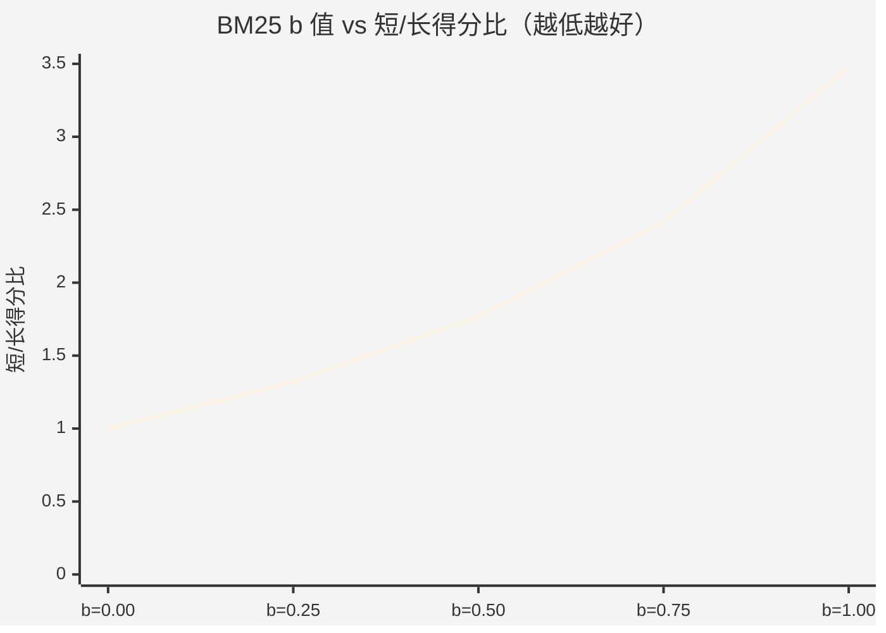

# Release Notes

## v1.2.0-rc3-final（2026-08-14）

**Release Tag**: `v1.2.0-rc3-final`（发布就绪检查目标版本）

### 变更总览（rc2 → rc3-final）

| 系列 | 提交 | 说明 |
|---|---|---|
| 测试可信度修复（A 类 5 项 → 3 根因闭环） | `08dffffd` | symlink 残留清理 / 权限异常 skip 兜底 / pre-commit TLM hook 同步 + 双 BOM 污染修复 |
| CI 回归守卫接入 | `08dffffd` | env-health-guard 并发治理 + 脏工作区阻断 + 分块回归入口 |
| 测试冷启动治理 | `398bb32e` | sqlite_vec 收集期 `find_spec()` 替代重型真实 import，消除冷启动卡死 |
| 规划可观测性 | `ed06e481` / `7ae969ce` | wire_trace_id 全链路追踪 + 异步桥模式标识 + 复杂度判定明细日志 |
| 谱系契约恢复 | 本次提交 | 恢复 `_BATCH_OBJECT_ID` 常量 + rejected 决策写谱系（EVO-T3 对齐） |
| 性能断言阈值 | 本次提交 | singleton 首次创建对比放宽绝对下限（1000us → 5000us），抵御共享 runner 调度噪音 |

### 规划 wire 排查日志（7ae969ce）

- `_run_async_in_sync` 补 `async_bridge.mode`（asyncio_run / thread_pool 两路）
- `wire.ingress` 补 `complexity_score` / `complex_matches` / `action_matches` 判定明细，回答"为什么判为 X 级"
- 回退三路（timeout / exception / 空响应）`fallback.detail` + `wire.fallback` WARNING 完整上下文

### 验证结果

| 验证项 | 结果 |
|---|---|
| A 类定向（3 文件） | **454 passed / 11 skipped / 0 failed** |
| 全量回归 chunk_2/chunk_3 | rc=0 全绿 |
| wire 模拟脚本（成功/异常/超时/inert 4 场景） | 全部通过 |
| pre-commit hook | 4 项检查全过 |

> 环境性说明：`test_singleton_performance` 性能断言抖动与 `test_create_async` chromadb 探测时序问题为共享 runner / 沙箱环境因素，非代码缺陷。

### 遗留

- B 类 24 项（固定 seed 验证前置）、C 类 3 项（环境伪失败）、D 类慢测试分流见 `docs/zh/B类遗留项修复执行计划_20260814.md`

---

## v1.5.0-bm25-normalization（2026-08-05）

### BM25 短文档归一化优化（b=0.75 → 0.5）

**Release Tag**: `v1.5.0-bm25-normalization`（annotated，指向 `9f6289f2`，已推送 origin + gitee）

#### 问题背景

VectorStore 的 InvertedIndex 使用 BM25 算法进行英文关键词检索。原默认长度归一化参数 `b=0.75` 导致**短文档得分虚高**：

- 查询 "machine learning" 时，2-token 短文档得分（1.35）反超包含完整语义的长文档（0.77）
- 短/长得分比高达 1.98x，违反检索相关性预期

#### 解决方案

将长度归一化参数 `b` 从 0.75 调整为 **0.5**，同时支持 `BM25_K1`/`BM25_B` 环境变量动态配置（无需改代码即可调参/回滚）。

核心变更（提交 `9de2fb45`）：
- `memory/vector_store/vector_store.py`：`_DEFAULT_B` 0.75→0.5，InvertedIndex 支持 k1/b 构造参数
- `.github/workflows/ci.yml`：新增两个 BM25 回归测试 step（基础对照 + 极端场景）

#### 效果数据

| 指标 | 优化前 (b=0.75) | 优化后 (b=0.5) | 改善 |
|------|----------------|----------------|------|
| 平均短/长得分比 | 1.98x | 1.48x | 降幅 25.0% |
| 极端场景（1-token vs 50-token） | 2.52x | 1.81x | 降幅 28.3% |
| 回归测试 | — | 基础 3/3 + 极端 5/5 + 单测 119 passed | 全部通过 |

#### b 值敏感性对比图表（核心结论）

BM25 长度归一化参数 `b` 对短文档虚高的影响（短/长得分比，实测数据）：

```
短/长得分比 (越低越不易虚高)
3.50x |                                        b=1.00 (3.48x)
3.00x |
2.50x |                             b=0.75 (2.42x)
2.00x |                    b=0.50 (1.77x) ──── 折中（当前默认）
1.50x |           b=0.25 (1.32x)
1.00x | b=0.00 (1.00x)
0.50x |
0.00x +----------------------------------------------------------------
      b=0.00      b=0.25      b=0.50      b=0.75      b=1.00
```



**关键结论**（[实测数据来源](docs/BM25_B_PARAMETER_RATIONALE.md)）：

| b 值 | 短/长得分比 | 定性 |
|------|------------|------|
| 0.00 | 1.00x | 无虚高，但无长度区分度（不推荐） |
| 0.25 | 1.32x | 轻微，短文档仍被轻微高估 |
| **0.50** | **1.77x** | **折中（当前默认）**：缓解虚高 + 保留长短区分度 |
| 0.75 | 2.42x | 偏高（原默认），短文档明显虚高 |
| 1.00 | 3.48x | 严重虚高（不可用） |

> **数学语义**：`b` 越大，文档长度 `dl/avgdl` 对 BM25 分母影响越强，短文档（`dl << avgdl`）分母趋小 → 得分虚高。b=0.5 是"缓解虚高"与"保留长度区分度"的平衡点。**b 值越大虚高越严重**（曾修正此认知方向）。

#### 变更文件（本次 Release，2 个提交，7 文件 +1325/-6）

| 类别 | 文件 | 提交 |
|------|------|------|
| 核心代码 | `memory/vector_store/vector_store.py`（+17/-6） | `9de2fb45` |
| 验证脚本 | `scripts/verify_bm25_optimization.py`、`scripts/verify_bm25_extreme_cases.py` | `9de2fb45` |
| 单元测试 | `tests/unit/test_vector_store_fallback.py`（TestBM25LengthNormalization） | `9de2fb45` |
| 文档 | `docs/BM25_B_PARAMETER_RATIONALE.md` + `docs/wiki/BM25_*.md` | 多个 |
| CI | `.github/workflows/ci.yml`（2 个 step） | — |
| 归档 | `docs/wiki/BM25_MILESTONE_EMAIL.md`、`BM25_COMMIT_MESSAGE.md`、`verify_wiki_rendering.py` | `9f6289f2` |

#### 兼容性

- 与技能检索的 BM25SkillSearcher（rank_bm25 实现，独立）正交不冲突
- 所有搜索/排序测试（119 passed, 1 xfailed）兼容
- 回滚方式：`export BM25_B=0.75`（零代码改动）

#### 已知说明

- b=0.5 缓解而非彻底消除短文档虚高（BM25 数学结构使然），虚高从"不合理"降至"合理"
- 优化过程中修正了一个认知错误：BM25 的 b 值越大虚高越严重（b=0→1.0x，b=1→3.48x），相关文档均已修正

---

### 历史版本

（此前版本记录在此追加）
