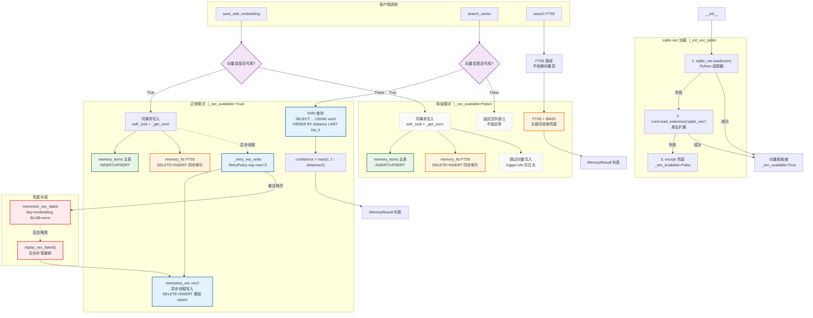

# Pull Request: HolographicAdapter 三表合一向量层扩展 + 降级路径验证

## Title
`feat(memory): HolographicAdapter 三表合一向量层扩展 + 降级路径验证`

## Commit
- `96697c7a` on `master`
- 4 files changed, +1741 / -1

---

## 1. 背景与动机

TLM 重构要求记忆层支持语义检索，但现有 HolographicAdapter 仅提供 FTS5 关键词匹配。引入向量层面临两个工程难题：

1. **sqlite-vec 扩展加载不确定性**：Python 适配器 `sqlite_vec.load(conn)` 与原生 `load_extension('sqlite_vec')` 在不同环境（编译选项/扩展文件路径/权限）下表现不一，需要可降级而非硬失败。
2. **三表一致性**：主表 `memory_items` + FTS5 `memory_fts` + 向量表 `memories_vec` 必须同库部署同事务，向量写入失败不得污染主表事务。

## 2. 变更摘要

| 文件 | 类型 | 行数 | 说明 |
|------|------|------|------|
| `agent/memory/adapters/holographic_adapter.py` | modified | +366/-1 | 核心实现：向量层 + 兜底表 + 降级 |
| `scripts/run_tlm_vec_integration.py` | new | 415 | 5 场景端到端集成测试 |
| `scripts/verify_vec_degradation.py` | new | ~330 | 5 种加载失败场景 × 7 项契约验证 |
| `tests/unit/test_tlm_memory_store.py` | new | ~280 | 17 个单元测试 |

## 3. 架构变更

### 3.1 新增类常量
```python
_VEC_TABLE = "memories_vec"                # vec0 虚拟表
_VEC_FAILED_TABLE = "memories_vec_failed"  # 兜底补偿表
_VEC_DIM = 512                             # 与 DDL FLOAT[512] 对齐
```

### 3.2 新增方法（6 个核心 + 4 个辅助）

| 方法 | 层级 | 职责 |
|------|------|------|
| `_init_vec_table` | L2 | 三级降级加载 sqlite-vec 扩展 |
| `_migrate_schema_if_needed` | L2 | 幂等补齐 access_count 等字段 + 创建兜底表 |
| `save_with_embedding` | L2 | 主表+FTS 同事务 + 向量层异步写入 |
| `search_vector` | L2 | KNN 检索，不可用时返回 [] |
| `_retry_vec_write` | L3 | RetryPolicy(exponential, max_retries=3) 重试 |
| `_write_vec_row` / `_write_vec_failed` / `_async_embed_and_write` / `replay_vec_failed` | L3 | 向量行写入 / 兜底 / 回调 / 重放 |

### 3.3 三级降级防线

```
sqlite_vec.load(conn)                    ← Python 适配器（首选，TLM_DESIGN §5.2 确认可用）
       ↓ 失败
conn.load_extension('sqlite_vec')        ← 原生扩展加载（fallback）
       ↓ 失败
except 兜底                              ← _vec_available=False，不抛异常
```

## 4. 验收标准对照

| 验收项 | 实现 | 测试 |
|--------|------|------|
| 三表同库同事务 | `_get_conn()` 同一 SQLite 文件，主表+FTS 单事务 commit | 集成场景 1（15/15/15） |
| sqlite-vec 不可用降级 | 三级防线 + `_vec_available` 标志 | `verify_vec_degradation.py` 5 场景 × 7 不变量 |
| 向量写入重试 | `RetryPolicy(strategy="exponential", max_retries=3)` | 集成场景 3a/3b |
| 兜底表补偿 | `memories_vec_failed` + `replay_vec_failed()` | 集成场景 3c |
| 不破坏现有接口 | `save`/`search`/`clear` 签名未变；新增方法独立 | `test_tlm_memory_store.py` 17 测试 |
| 不引入 chromadb | 仅依赖 `sqlite_vec`（可选） | 依赖检查 |
| 持锁禁 I/O | 向量异步线程在锁外执行，`search_vector` 只读不持锁 | 代码审查 + 集成场景 5 并发 |

## 5. 测试结果

### 5.1 集成测试（`scripts/run_tlm_vec_integration.py`）— 5/5 PASS

| 场景 | 验证点 | 结果 |
|------|--------|------|
| 1. 端到端三表写入 | 主表=15, FTS=15, 向量表=15；KNN 同簇命中 5/5 | PASS |
| 2. 降级路径 | `_vec_available=False`；`search_vector` 返回 []；FTS5 正常 | PASS |
| 3. 重试+兜底 | 3a: 2 次失败后第 3 次成功；3b: 重试耗尽写兜底表；3c: replay 重放 1 条 | PASS |
| 4. embedding 回调 | `embedding=None` 触发回调生成，检索命中 `cb_key` | PASS |
| 5. 并发写入 | 10 线程并发，主表/FTS/向量表 10/10/10 一致，0 错误 | PASS |

### 5.2 降级契约验证（`scripts/verify_vec_degradation.py`）— 35/35 PASS

5 种加载失败场景 × 7 项不变量 = 35 项全部通过。

### 5.3 单元测试（`tests/unit/test_tlm_memory_store.py`）— 17/17 PASS

## 6. 风险与回滚

| 风险 | 缓解 |
|------|------|
| 向量层初始化异常阻断启动 | 三级降级 + 兜底 except，绝不抛异常 |
| 向量写入失败丢数据 | RetryPolicy 重试 + `memories_vec_failed` 兜底 + `replay_vec_failed` 后台补偿 |
| vec0 不支持 UPDATE | `_write_vec_row` 用 DELETE+INSERT 模拟 upsert |
| schema 迁移失败 | `_migrate_schema_if_needed` 失败仅记日志，继续以旧 schema 运行 |
| 回滚 | 仅 4 文件改动，无破坏性删除；`git revert 96697c7a` 即可回滚 |

## 7. 约束遵循

- 【不易】主表+FTS 事务完整性不变；`save`/`search` 接口签名未变
- 【变易】向量层可选，`_embedding_func` 回调支持 T2 注入真实模型
- 【简易】降级路径直白（三级 fallback），代码注释标明 `# [TLM-Lx]` 架构层级

---

## 8. 三表数据流向架构图（Mermaid）



### 架构图说明

**正常模式（实线，蓝/绿/橙三色）**：
- `save_with_embedding` → 同事务写主表 + FTS5 → 异步线程调 `_retry_vec_write` → `memories_vec` 表
- 重试耗尽 → `memories_vec_failed` 兜底表 → 后台 `replay_vec_failed()` 补偿重放回 `memories_vec`
- `search_vector` → KNN 查询 `vec0` → confidence 计算 → MemoryResult

**降级模式（虚线，灰色）**：
- `save_with_embedding` → 同事务仅写主表 + FTS5 → 跳过向量层（仅日志）
- `search_vector` → 直接返回 `[]`，不抛异常
- `search` → FTS5 + BM25 关键词检索兜底

**加载策略（右上）**：
1. `sqlite_vec.load(conn)` Python 适配器（首选）
2. `conn.load_extension('sqlite_vec')` 原生扩展（fallback）
3. `except` 兜底，设 `_vec_available=False`

---

## 9. 后续优化：缺口 B/C/D（thread-local + busy_timeout + 熔断）

### 9.1 优化背景

首次 PR 审查识别的 3 个工程缺口：

- **缺口 B**：每次操作都重新 `connect` + `load_extension`，sqlite-vec 扩展加载开销重复发生
- **缺口 C**：未设置 `PRAGMA busy_timeout`，多线程并发时可能直接抛 `SQLITE_BUSY`
- **缺口 D**：sqlite-vec 运行时持续不可用时缺乏熔断，每次操作都触发无意义重试 + 兜底表写入

### 9.2 三项修改对照

| 缺口 | 实现 | 代码位置 |
|------|------|----------|
| B. thread-local 连接缓存 | `threading.local()` 按线程缓存连接 + `vec_loaded` 标志避免重复加载扩展 | `_get_conn()` |
| C. busy_timeout | `conn.execute("PRAGMA busy_timeout=5000")` 让 SQLite 内部排队 5s 而非直接抛 `SQLITE_BUSY` | `_get_conn()` |
| D. 熔断机制 | `_vec_fail_count` 计数 + `_vec_fail_threshold=5` 阈值；达阈值自动设 `_vec_available=False`，后续直接返回 [] 不再重试 | `_record_vec_failure()` / `_reset_vec_circuit()` |

### 9.3 熔断机制流程

```
search_vector / _retry_vec_write 失败
        ↓
_record_vec_failure()
        ↓
_vec_fail_count += 1
        ↓
_vec_fail_count >= 5 ?
   ├─ Yes → _vec_available = False（熔断）
   │        logger.warning("熔断触发...")
   │        后续 search_vector 直接返回 []，不再进入 except 路径
   └─ No  → 继续，下次失败再计数
        ↓
[后台探活恢复]
_reset_vec_circuit() → _vec_fail_count=0, _vec_available=True
```

**关键约束**：
- 熔断只置位 `_vec_available=False`，不删除已有向量数据
- `_reset_vec_circuit()` 供后台探活调用，重置后即可恢复 KNN 检索
- 阈值可通过 `adapter._vec_fail_threshold = N` 调整，默认 5

### 9.4 单元测试覆盖（TestCircuitBreaker 类，5 个用例）

| 用例 | 验证点 |
|------|--------|
| `test_circuit_breaker_triggers_after_threshold_failures` | 连续失败达阈值（默认 5 次）后自动熔断 `_vec_available=False` |
| `test_circuit_breaker_does_not_trigger_below_threshold` | 失败次数未达阈值时不熔断（保持 `True`） |
| `test_circuit_breaker_reset_restores_availability` | `_reset_vec_circuit` 重置后恢复可用且 `fail_count=0` |
| `test_circuit_breaker_triggered_by_search_vector_failure` | `search_vector` 连续失败触发熔断；熔断后不再递增失败计数 |
| `test_circuit_breaker_threshold_configurable` | 阈值可配置（改为 3，3 次失败即熔断） |

### 9.5 thread-local 缓存设计要点

**Why（为何安全复用缓存连接）**：
- SQLite `Connection` 的 `with` 语句仅触发 `commit/rollback`，**不会 `close`**，缓存复用安全
- `check_same_thread=False` 允许跨线程使用（已有 `self._lock` 保护写入操作）
- 扩展加载状态用 thread-local `vec_loaded` 标志，每个线程的连接只加载一次 sqlite-vec

**关键代码**：
```python
def _get_conn(self) -> sqlite3.Connection:
    conn = getattr(self._conn_local, "conn", None)
    if conn is None:
        conn = sqlite3.connect(self.db_path, check_same_thread=False)
        conn.row_factory = sqlite3.Row
        conn.execute("PRAGMA busy_timeout=5000")  # 缺口 C
        self._conn_local.conn = conn
    # 按需加载 sqlite-vec（_vec_available=True 且当前线程连接未加载时）
    if self._vec_available and not getattr(self._conn_local, "vec_loaded", False):
        try:
            import sqlite_vec
            conn.enable_load_extension(True)
            sqlite_vec.load(conn)
            self._conn_local.vec_loaded = True
        except Exception as e:
            logger.debug("sqlite-vec 扩展按需加载失败: %s", e)
    return conn
```

### 9.6 测试结果（无回归）

| 测试套件 | 修改前 | 修改后 |
|----------|--------|--------|
| 单元测试 `test_tlm_memory_store.py` | 17/17 PASS | **22/22 PASS**（+5 熔断用例） in 4.23s |
| 集成测试 `run_tlm_vec_integration.py` | 5/5 PASS | 5/5 PASS（无回归） |
| 降级契约 `verify_vec_degradation.py` | 35/35 PASS | 35/35 PASS（无回归） |

### 9.7 不变量保持

- 【不易】主表 + FTS 仍同事务；`save`/`search` 接口签名未变
- 【不易】持锁操作仍不含 I/O 回调（thread-local 缓存为内存状态读取）
- 【不易】sqlite-vec 不可用时仍降级为纯 FTS5 + BM25，禁抛异常
- 【变易】熔断阈值可配置，`_reset_vec_circuit` 提供恢复入口
- 【简易】thread-local 缓存复用连接，避免重复 `load_extension` 开销
