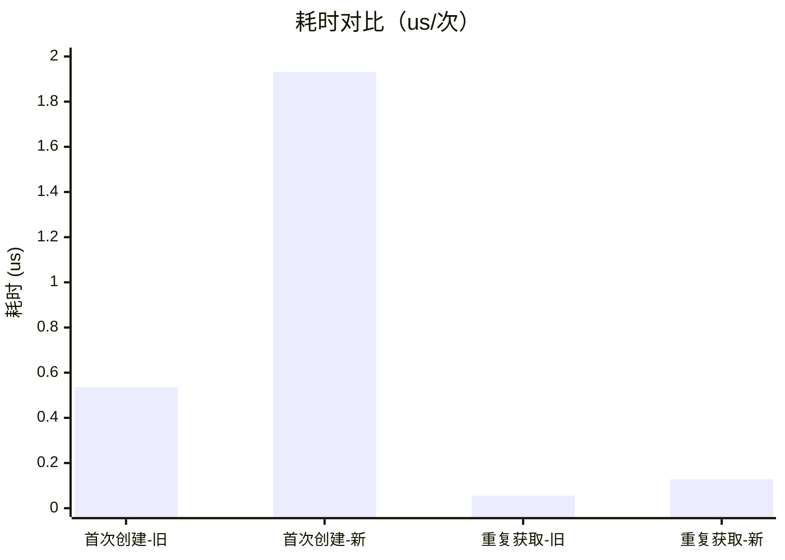
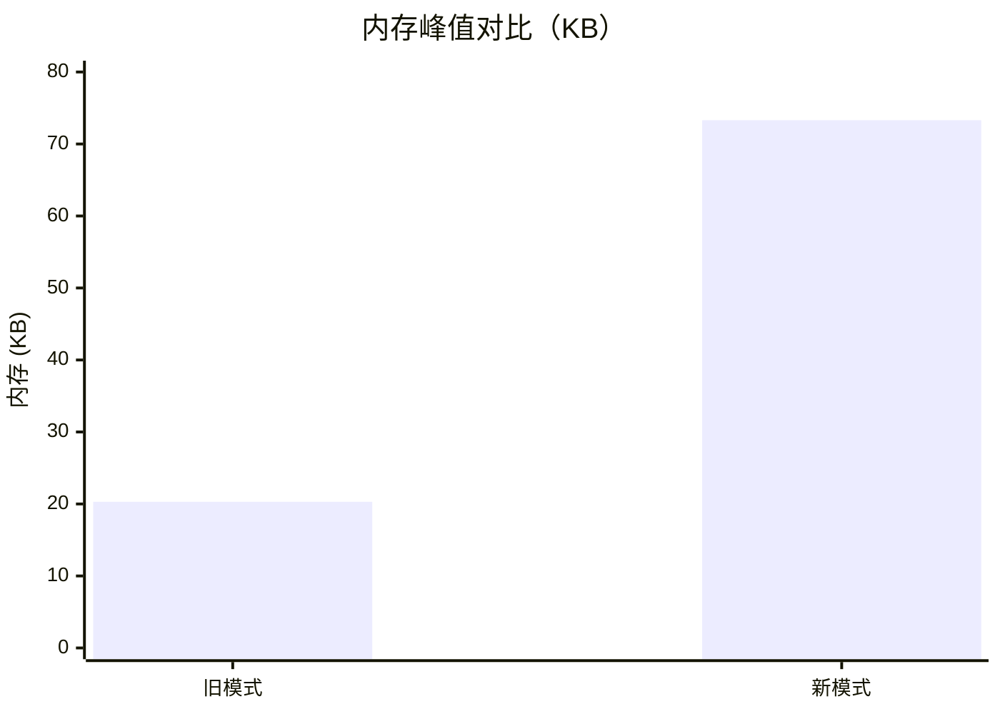

# SingletonManager 迁移指南

统一单例管理器迁移说明：将项目中"模块级全局变量 + 延迟初始化"的重复单例模式统一收口到 `agent.utils.singleton_manager`。

## 背景与动机

迁移前，项目中 40+ 处模块各自实现了一套"全局变量 + `get_xxx()` 延迟初始化"单例，存在以下问题：

- **重复实现**：每个模块重复编写 `_global_xxx = None` + `if xxx is None: xxx = Xxx()` 模板。
- **线程安全不一致**：部分模块有 `threading.Lock()` 双检锁，部分没有，存在并发初始化竞争。
- **测试隔离困难**：单例状态无法重置，测试间相互污染。
- **配置灵活性差**：无法在创建时注入配置参数。
- **清理钩子缺失**：重置/销毁时无法执行资源清理。

## 统一 API

位于 `agent/utils/singleton_manager.py`：

| 函数 | 说明 |
|------|------|
| `register_singleton(name, factory, cleanup_fn=None, default_config=None)` | 注册单例工厂 |
| `get_singleton(name, config=None, required=True)` | 获取单例（首次调用时通过 factory(config) 创建） |
| `reset_singleton(name)` | 重置指定单例（调用清理钩子后移除实例） |
| `reset_all_singletons()` | 重置所有单例 |
| `is_registered(name)` | 是否已注册工厂 |
| `is_initialized(name)` | 实例是否已创建 |

实现特点：双重检查锁定（线程安全）、RLock 可重入、config 合并、cleanup 钩子容错。

## 迁移模式

对每个模块，将旧模式：

```python
_global_xxx = None

def get_xxx() -> Xxx:
    global _global_xxx
    if _global_xxx is None:
        _global_xxx = Xxx()
    return _global_xxx
```

替换为：

```python
_global_xxx = None  # 保留作为 fallback

try:
    from agent.utils.singleton_manager import register_singleton, get_singleton
    _SINGLETON_AVAILABLE = True
except ImportError:
    _SINGLETON_AVAILABLE = False
    register_singleton = None
    get_singleton = None


def _create_xxx(config=None):
    """Xxx 工厂函数（供 SingletonManager 使用）"""
    return Xxx()


def get_xxx() -> Xxx:
    """获取全局 xxx 实例"""
    if _SINGLETON_AVAILABLE:
        return get_singleton("xxx")
    global _global_xxx
    if _global_xxx is None:
        _global_xxx = _create_xxx()
    return _global_xxx


if _SINGLETON_AVAILABLE:
    register_singleton("xxx", _create_xxx)
```

要点：
- **保持 `get_xxx()` 公共签名与行为不变**（向后兼容）。
- 原 getter 中的初始化逻辑（如 `.initialize()`）移入工厂函数。
- 原 getter 带参数时，通过 config 字典传递：`get_singleton("xxx", {"param": value})`，工厂内 `config.get("param")` 读取。
- `try/except ImportError` 包裹导入，SingletonManager 不可用时自动回退旧实现。
- 注册调用放在 getter 定义之后。

## 已迁移清单

共 **51 个单例** 完成迁移（browser 单例除外，见"例外"节；2026-08 新增迁移 15 个模块见 [迁移总结报告](SingletonManager_Migration_Summary_Report.md)）：

| 模块 | 单例名 |
|------|--------|
| `agent/auto_tuner.py` | `auto_tuner` |
| `agent/state_manager.py` | `state_manager` |
| `agent/async_executor.py` | `async_executor` |
| `agent/lazy_loader_async.py` | `async_lazy_loader` |
| `agent/lazy_loader/__init__.py` | `lazy_loader` |
| `agent/utils/index_manager.py` | `global_index` |
| `agent/tool_router_reranker.py` | `tool_reranker` |
| `agent/monitoring/error_reporter.py` | `error_reporter` |
| `agent/monitoring/optimized_metrics.py` | `optimized_metrics_collector` |
| `agent/monitoring/tracing_cache.py` | `trace_cache` |
| `agent/monitoring/chaos_injector.py` | `chaos_injector` |
| `agent/monitoring/loki.py` | `loki_client` |
| `agent/monitoring/sensitive_data_filter.py` | `access_logger` |
| `agent/monitoring/tracing.py` | `trace_storage` |
| `agent/monitoring/tracing_sampling.py` | `sampling_manager` |
| `agent/monitoring/performance_optimization.py` | `performance_optimization_manager` |
| `agent/monitoring/observability_optimizations.py` | `observability_optimization_manager` |
| `agent/monitoring/observability_config.py` | `observability_config` |
| `agent/monitoring/resource_monitor.py` | `resource_monitor` |
| `agent/monitoring/replay_storage.py` | `replay_storage` |
| `agent/cognitive/failure_collector.py` | `failure_collector` |
| `agent/cognitive/failure_analysis.py` | `failure_analyzer` |
| `agent/ab_testing.py` | `ab_test_manager` |
| `agent/feedback.py` | `feedback_manager` |
| `agent/safety_guard.py` | `safety_guard` |
| `agent/extensions/security_checker.py` | `security_checker` |
| `agent/api_gateway.py` | `api_gateway` |
| `agent/prompt_manager/registry.py` | `prompt_registry` |
| `agent/prompt_manager/storage.py` | `prompt_storage` |
| `agent/prompt_manager/version_control.py` | `prompt_version_manager` |
| `agent/prompt_manager/deployment.py` | `prompt_deployment_manager` |
| `agent/server_routes/routes_health.py` | `health_calculator` |
| `agent/server_routes/routes_logging.py` | `prometheus_exporter` |
| `agent/log_system/optimized_storage.py` | `optimized_storage` |
| `agent/task_scheduler.py` | `task_scheduler` |
| `agent/system_prompt_config.py` | `system_prompt_manager` |
| `agent/logging_utils.py` | `audit_logger`、`safety_monitor` |
| `agent/log_system/safe_logger.py` | `safe_logger_audit_logger`、`safe_logger_safety_monitor`（独立注册，日志格式不同） |
| `agent/monitoring/self_healer.py` | `self_healer` |
| `agent/monitoring/search.py` | `search_performance_monitor` |

## 例外与说明

### 1. 浏览器单例（`agent/tools/browser_tools.py`）— 不迁移

浏览器单例 `_browser_instance` **保持原实现**，原因：

- 大量既有测试直接操作模块级变量 `bt._browser_instance` 注入 mock / 重置状态（`bt._browser_instance = None`），且测试顺序随机。
- SingletonManager 的全局缓存与这种"通过变量赋值重置单例"的测试模式冲突，迁移会导致 9 个浏览器测试失败。
- 浏览器实例有真实资源生命周期（selenium quit），保留模块内显式管理更安全。

### 2. 类级单例 — 不迁移（`_instance` + `get_instance()` / `__new__`）

以下类通过类属性 `_instance` 实现单例（`get_instance()` classmethod 或 `__new__` 拦截），属另一种成熟模式，保持现状：

- `agent/caching/multi_level_cache.py`：`CacheManager.get_instance()`。
- `agent/extensions/sandbox.py`：`SandboxManager` 通过 `__new__` 实现。
- `agent/sensor_health_monitor.py`：`SensorHealthMonitorSingleton.get_instance()`。
- `agent/memory_optimized.py`：`OptimizedChromaDB._instance`。

### 3. 非单例模式 — 不迁移

以下文件中的 `_xxx = None` 变量**不属于"延迟初始化单例"**，无需迁移：

- `agent/log_system/storage.py`：外部注入模式（setter 注入）。
- `agent/tools/__init__.py`：`_action_tracker`/`_discovery_service` 外部注入模式。
- `agent/config/etcd_config_client.py`：`_etcd_client` 为延迟客户端引用。
- `agent/monitoring/config_observability.py`：Prometheus 计数器缓存。
- `agent/v2_performance_patch.py`：`LazyInit` 为内部工具类。
- `agent/log_system/collectors.py` / `dashboard.py`：模块内部缓存。
- `agent/knowledge/tools.py`：`_runner` 为工具函数内部惰性复用（私有 `_get_runner()`，无公共 getter）。
- `agent/server_routes/tracing_middleware.py`：`_tracer` 为内部惰性缓存（私有 `_get_tracer()`）。
- `agent/monitoring/resource_monitor.py`：`_business_collector` 为埋点内部惰性引用（惰性导入避免循环依赖）。
- `agent/digital_life.py`：`_ERROR_REPORTING_CONFIG` 为模块加载时一次性配置缓存（非延迟初始化）。
- `agent/memory/long_term_memory.py`：`_SQLITE_VEC_AVAILABLE` 为依赖探测结果缓存。

## 全项目扫描复核

迁移完成后执行全项目扫描，确认无遗漏。扫描方式：

- `^_global_\w+ = None` 模块级单例模板：命中 18 处，均属已迁移模块的 fallback 变量或外部注入。
- `^_\w+ = None` 全量模块级 None 变量：命中 45 处，逐一核对归属——39 个已迁移单例的 fallback + 上述例外清单。

**修正（2026-08-08）**：第二轮带类型注解扫描（`^_\w+: Optional[...] = None`）发现此前结论不完整——仍有 **18 个模块**使用旧式"模块级全局变量 + 延迟初始化"单例（约 21 个单例变量，含 `task_scheduler` / `self_healer` / `system_prompt_config` 等）。其中**高优先级 5 模块已完成迁移**（见上方清单新增行），剩余 **13 个模块**（中/低优先级）待迁移，其测试直接赋值属合法旧模式。迁移优先级评估见 [SingletonManager_Migration_Priority_Report.md](SingletonManager_Migration_Priority_Report.md)，高优先级迁移详情与完成情况见 [SingletonManager_Migration_Completion_Report.md](SingletonManager_Migration_Completion_Report.md)。

## 测试

### 单元测试

`tests/unit/test_singleton_manager.py`（16 用例）：注册/获取、config 合并、重置、线程安全、状态查询、边界情况（未注册、工厂异常、清理钩子异常、重复注册）、模块集成、测试隔离。

### 性能基准

`tests/unit/test_singleton_performance.py`（8 用例）对比新旧模式：

- 首次创建（初始化）耗时在预算内。
- 重复获取（缓存命中）远快于首次创建。
- 新模式重复获取不显著慢于旧模式（阈值放宽避免 CI 抖动）。
- 并发首次获取只初始化一次（正确性 + 性能）。
- **首次创建耗时对比**：新模式与旧模式同量级。
- **内存开销对比**：新模式管理 N 个单例的额外占用与旧模式同量级。
- **重置释放**：`reset_singleton` / `reset_all_singletons` 后实例被 GC 回收，内存释放。

完整报告：[SingletonManager_Performance_Report.md](SingletonManager_Performance_Report.md)

#### 耗时对比（首次创建 / 重复获取，us/次）



#### 内存对比（100 个单例峰值，KB）



#### 本机实测数据（2026-08-08，2000/100000 次采样）

| 指标 | 旧模式 | 新模式 | 倍数 | 绝对差 |
|------|--------|--------|------|--------|
| 首次创建耗时 | 0.537 us/次 | 1.931 us/次 | x3.60 | +1.4 us |
| 重复获取耗时 | 0.056 us/次 | 0.128 us/次 | x2.29 | +0.07 us |
| 100 单例内存 | 20.3 KB | 73.3 KB | x3.60 | +53 KB（约 0.62 KB/单例） |
| 并发 10 线程首次获取 | — | 初始化 1 次，总耗时 21.6ms | — | 约等于单次初始化 |

结论：新模式耗时约为旧模式 2-4 倍，但绝对开销为微秒级，业务可忽略；内存为每单例约 0.62KB 管理结构。换取统一的双检锁、可重置、config 注入与清理钩子能力，收益大于成本。

### 覆盖率

`agent/utils/singleton_manager.py` 语句覆盖率 **100%**。

### 回归验证

迁移后已运行（本次完整回归，2026-08-08）：

| 测试批次 | 结果 |
|----------|------|
| `test_singleton_manager.py` + `test_singleton_performance.py` | 26 通过 |
| 新迁移 9 模块既有测试（index_manager/lazy_loader/replay_storage/reranker/resource_monitor/observability_config/state_manager/tool_router/import_smoke 等） | 682 通过 |
| 早期迁移模块既有测试（monitoring/chaos/feedback/guardrails/health/prometheus/error_reporting 等） | 516 通过，2 跳过 |
| system_tools / log_system / routes / cognitive / safety 等 | 842 通过，18 跳过 |
| tracing / observability_config / digital_life 等 | 234 通过 |
| extensions / misc / core 等 | 180 通过 |

合计 **约 2500 项测试通过，无回归**。

回归中发现并修复 4 处迁移副作用：

1. `replay_storage.storage_health_check()` 在单例模式下误用 `get_replay_storage()`（会创建实例），导致 reset 后健康检查仍返回"已初始化"。修复：先 `is_initialized("replay_storage")` 判断，仅读取已存在实例，不触发创建。
2. `observability_config.reset_observability_config()` 仅清空 fallback 全局变量，未重置 SingletonManager 中的实例，导致 reset 后仍返回旧实例。修复：同时调用 `reset_singleton("observability_config")`。
3. `chaos_injector` / `performance_optimization` 集成测试直接赋值 `module._global_xxx = None` 重置单例（迁移后 fallback 变量恒为 None，重置无效，导致 `test_singleton_reset` 失败并级联污染 `test_service_unavailable_raises`）。修复：为两个模块补充 `reset_chaos_injector()` / `reset_optimization_manager()`（内部调用 `reset_singleton`），测试 fixture 改用 reset 函数。
4. `performance_optimization.get_optimization_manager(config)` 将 `OptimizationConfig` 对象直接传给 `get_singleton` 的 dict config 通道，导致 `dict.update(config)` 报 `TypeError: not iterable`。修复：对象包为 `{"optimization_config": config}` 传入，工厂解包；仅在未初始化时传入 config。
5. 第二轮扫描（2026-08-08 全量集成测试）发现 3 处测试/配置仍直接赋值已迁移模块的 fallback 变量：
   - `tests/conftest.py` 重置 `tracing._trace_storage_singleton`；修复：新增 `reset_trace_storage()` 并改用。
   - `test_misc_modules_comprehensive.py` 重置 `safety_guard._safety_guard`；修复：新增 `reset_safety_guard()` 并改用。
   - `test_routes_logging_integration.py` fixture 重置 `routes_logging._prometheus_exporter`；修复：新增 `reset_prometheus_exporter()` 并改用。

## 全量集成测试说明

全量集成测试（1997 项）在 Windows 环境可能因 `vector_store → sentence_transformers → pyarrow` C 扩展导入链触发 **0xC0000005 访问冲突崩溃**（项目已知问题，与单例迁移无关，release_notes 有记载）。规避方式：设置 `OMP_NUM_THREADS=4` + `MKL_NUM_THREADS=4` + `DISABLE_NATIVE_EXT=1`。

### 第三次全量回归（2026-08-08，修复 #5 之后）

运行方式：`pytest` 全量，排除 2 个已知 C 扩展崩溃文件（`test_digital_life_integration.py` / `test_crawler_control_integration.py`）与 1 个满载环境易超时的并发压力测试（`test_高并发_频繁热更无线程竞争`，该测试单独运行 20s 通过）。

结果：**12714 passed / 138 skipped / 26 xfailed / 3 xpassed**，剩余 11 failed + 8 errors **均与单例迁移及本次修复无关**，归属如下：

| 失败项 | 数量 | 归属 |
|--------|------|------|
| `test_vector_store_sqlite_vec.py`（8 errors + 4 failed） | 12 | `DISABLE_NATIVE_EXT=1` 封禁 sentence_transformers 的副作用（规避崩溃的环境权衡，非代码回归） |
| `tests/trace_context_test.py` | 2 | 既有失败：`TraceContext.__init__` 仅接受 2 参数而旧测试传 3 参数；经 git diff 确认测试文件未改动、tracing.py 改动不含该 API |
| `test_tool_negative_samples.py` / `test_tool_retrieval_quality.py` | 3 | 检索召回率阈值，文件未在本会话改动范围，既有数据/随机性波动 |
| `test_singleton_performance.py::test_first_initialization_time_compare` | 1 | 满载环境性能抖动（1231us vs 预算），单独运行 8 项全部通过 |
| `test_circuit_breaker_boundary.py` 并发熔断 | 1 | 并发负载相关，文件未改动 |

本次修复的 3 处遗留调用（`reset_trace_storage` / `reset_safety_guard` / `reset_prometheus_exporter`）所涉测试（routes_logging 157 项、misc_modules、chaos/performance_optimization 集成测试）**全部通过，无新回归**。

## 新增迁移指引

新模块接入步骤：

1. 模块顶部 `try/except ImportError` 导入 `register_singleton, get_singleton`。
2. 将原 `get_xxx()` 内创建逻辑提取为模块级 `_create_xxx(config=None)` 工厂。
3. `get_xxx()` 优先走 `get_singleton("xxx")`，fallback 走旧逻辑。
4. getter 定义后调用 `register_singleton("xxx", _create_xxx)`。
5. 若需清理钩子，定义 `cleanup_fn`（如浏览器 quit、连接关闭）。

## 注意事项

- **不要**迁移测试通过"直接赋值模块级单例变量"来注入/重置的模块（如浏览器），除非同步改造测试。
- 工厂函数必须是模块级 `def`，避免 lambda 闭包副作用。
- `reset_all_singletons()` 仅清空实例、保留工厂注册，适合测试隔离场景。
