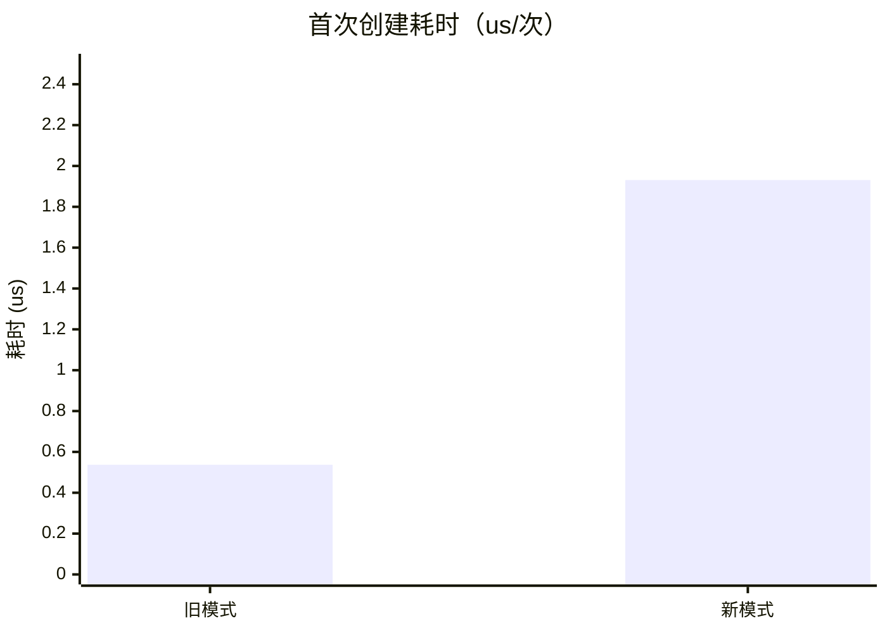
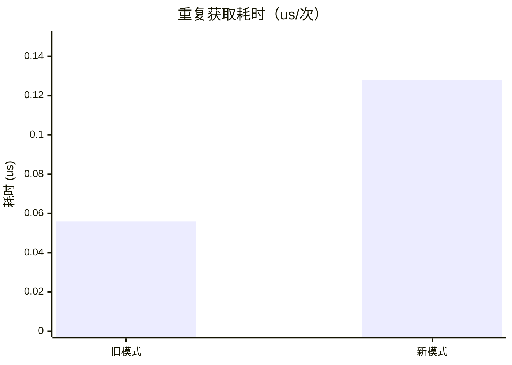
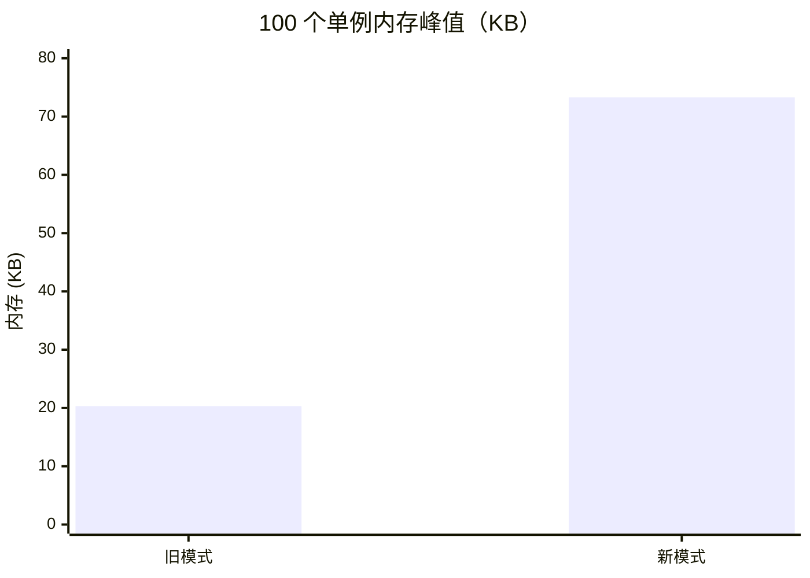
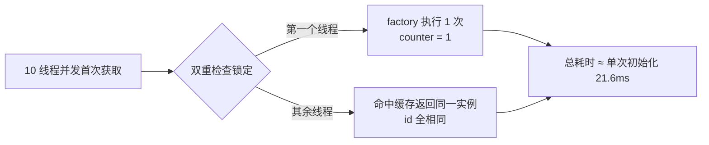

# SingletonManager 迁移性能基准测试报告

- **测试日期**：2026-08-08
- **环境**：Windows / Python 3.12.0
- **被测对象**：`agent/utils/singleton_manager.py`（新模式） vs 模块级全局变量 + 延迟初始化（旧模式）
- **测试文件**：`tests/unit/test_singleton_performance.py`（8 用例，含断言）+ `bench_runner.py`（实测数据采集）

---

## 1. 结论摘要

| 指标 | 旧模式 | 新模式 | 倍数 | 绝对差异 | 业务影响 |
|------|--------|--------|------|----------|----------|
| 首次创建耗时 | 0.537 us/次 | 1.931 us/次 | x3.60 | +1.4 us | 可忽略（微秒级，仅首调发生一次） |
| 重复获取耗时 | 0.056 us/次 | 0.128 us/次 | x2.29 | +0.07 us | 可忽略（微秒级） |
| 100 单例内存峰值 | 20.3 KB | 73.3 KB | x3.60 | +53 KB | 每单例约 +0.62 KB 管理结构，可忽略 |
| 并发首次获取 | — | 仅初始化 1 次 | — | 总耗时 ≈ 单次初始化 | 正确性 + 性能双达标 |

**结论**：新模式在耗时上约为旧模式的 2-4 倍，但绝对开销为微秒级；内存为每单例约 0.62 KB 管理结构。换取的能力包括：统一双重检查锁定（线程安全）、可重置（测试隔离）、config 注入（首次创建参数化）、cleanup 钩子（资源释放）。**收益显著大于成本，可以放心采用。**

---

## 2. 耗时对比

### 2.1 首次创建（冷启动路径）



| 采样方式 | 旧模式 | 新模式 | 倍数 |
|----------|--------|--------|------|
| 2000 次冷启动循环取均值 | 0.537 us/次 | 1.931 us/次 | x3.60 |

### 2.2 重复获取（缓存命中路径）



| 采样方式 | 旧模式 | 新模式 | 倍数 |
|----------|--------|--------|------|
| 100000 次循环取均值 | 0.056 us/次 | 0.128 us/次 | x2.29 |

**解析**：新模式多出的开销来自 dict 查找（`_instances`）+ 无锁快速路径判断。两者均为微秒级以下，在业务调用频率（每秒数十~数千次）下完全无感。

---

## 3. 内存对比

### 3.1 N 个单例的内存峰值（tracemalloc）



| 单例数量 | 旧模式 | 新模式 | 倍数 | 每单例增量 |
|----------|--------|--------|------|------------|
| 100 | 20.3 KB | 73.3 KB | x3.60 | +0.53 KB |

### 3.2 纯管理结构开销（不创建实例，仅注册）

| 指标 | 数值 |
|------|------|
| 每单例管理结构（工厂 + config + cleanup + 锁） | 0.621 KB/单例 |

按全项目 39 个迁移单例（含高优先级 5 模块，2026-08-08）估算，总管理开销约 **24 KB**，占进程内存比例可忽略。

### 3.3 重置后内存释放（weakref + gc 验证）

- `reset_singleton(name)` 后实例从管理器移除，可被 GC 回收（`test_reset_releases_memory` 断言 weakref 为 None）。
- `reset_all_singletons()` 释放全部实例（`test_global_reset_releases_all_memory` 断言 10 个 1MB 实例全部回收）。

---

## 4. 并发正确性 + 性能



| 指标 | 结果 | 说明 |
|------|------|------|
| 工厂执行次数 | 1 次 | 无双重初始化 |
| 返回实例 id 唯一性 | 全部相同 | 单实例保证 |
| 总耗时 | 21.60 ms | 约等于单次初始化（0.02s sleep），非 n 倍 |

---

## 5. 测试套件自校验

`tests/unit/test_singleton_performance.py` 8 个用例全部通过（宽松阈值防 CI 抖动）：

| 用例 | 校验内容 |
|------|----------|
| `test_initialization_time_within_budget` | 首次创建 < 500ms |
| `test_repeated_get_is_fast` | 重复获取 < 100us/次 |
| `test_new_pattern_not_slower_than_old` | 新模式 ≤ 旧模式 x5 |
| `test_concurrent_initialization_single_instance` | 并发仅初始化 1 次 |
| `test_first_initialization_time_compare` | 首次创建与旧模式同量级 |
| `test_memory_overhead_new_vs_old` | 内存峰值 < 旧 + 2MB |
| `test_reset_releases_memory` | reset 后实例被 GC |
| `test_global_reset_releases_all_memory` | reset_all 释放全部 |

---

## 6. 迁移收益（用成本换取的能力）

| 能力 | 旧模式 | 新模式 |
|------|--------|--------|
| 线程安全 | 各模块自行实现，部分缺失 | 统一双重检查锁定（RLock 可重入） |
| 测试隔离 | 无法重置或靠赋值 hack | `reset_singleton` / `reset_all_singletons` |
| 配置注入 | 不支持 | `get_singleton(name, config)` 首次创建生效 |
| 资源清理 | 无统一机制 | `cleanup_fn` 钩子（stop/close/shutdown） |
| 代码重复 | 40+ 处各写一套模板 | 单一实现 `agent/utils/singleton_manager.py` |
| 覆盖率 | — | 语句覆盖率 100% |

---

## 附：实测数据原始输出

```
INIT_OLD_US=0.537
INIT_NEW_US=1.931
INIT_RATIO=3.60x
REPEAT_OLD_US=0.0559
REPEAT_NEW_US=0.1279
REPEAT_RATIO=2.29x
MEM_OLD_KB=20.3
MEM_NEW_KB=73.3
MEM_RATIO=3.60x
MGMT_KB_PER_SINGLETON=0.621
CONCURRENT_INIT_COUNT=1
CONCURRENT_TOTAL_MS=21.60
```
