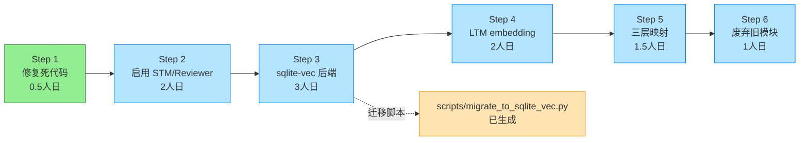

# TLM 重构任务清单与 Git 分支策略

> **文档定位**: 将 `TLM_DESIGN.md` 附录 C 的 6 步重构建议拆解为可独立交付的任务，并定义对应的 Git 分支策略。
> **生成日期**: 2026-07-13
> **依赖文档**: [TLM_DESIGN.md](./TLM_DESIGN.md)
> **执行原则**: 每步独立可回滚；API 契约白名单（TLM_DESIGN.md §4）不可破坏

---

## 1. Git 分支策略总览

### 1.1 分支模型

采用 **GitFlow 简化版** + **短生命周期 feature 分支**：

```
master (主干, 稳定)
  │
  ├─ fix/tlm-step1-memory-abstractor-import     ← Step 1 (已合并)
  │
  ├─ feature/tlm-step2-enable-stm-reviewer       ← Step 2
  │
  ├─ feature/tlm-step3-vectorstore-sqlite-vec    ← Step 3 (依赖 Step 2 合并)
  │
  ├─ feature/tlm-step4-ltm-embedding-column      ← Step 4 (依赖 Step 3 合并)
  │
  ├─ feature/tlm-step5-router-tier-mapping       ← Step 5 (依赖 Step 4 合并)
  │
  └─ refactor/tlm-step6-deprecate-memory-opt     ← Step 6 (依赖 Step 5 合并)
```

### 1.2 分支命名规范

| 类型 | 前缀 | 示例 | 用途 |
|------|------|------|------|
| Bug 修复 | `fix/` | `fix/tlm-step1-memory-abstractor-import` | 修复已知 Bug |
| 新功能 | `feature/` | `feature/tlm-step3-vectorstore-sqlite-vec` | 新增能力 |
| 重构 | `refactor/` | `refactor/tlm-step6-deprecate-memory-opt` | 不改接口的内部重构 |
| 文档 | `docs/` | `docs/tlm-design` | 仅文档变更 |
| 测试 | `test/` | `test/tlm-step3-vector-store-sqlite-vec` | 仅测试变更 |

### 1.3 合并策略

| 场景 | 策略 | 理由 |
|------|------|------|
| Step 1 (Bug 修复) | **Squash merge** | 单一修复点，压缩为 1 个 commit |
| Step 2-5 (功能扩展) | **Merge commit** | 保留分步开发历史，便于回滚到特定步骤 |
| Step 6 (废弃重构) | **Squash merge** | 删除操作集中，压缩为 1 个 commit |
| 紧急回滚 | `git revert -m 1 <merge_commit>` | 保留历史，不 force push |

### 1.4 合并门槛（DoD - Definition of Done）

每个分支合并前必须满足：

- [ ] 单元测试通过率 100%
- [ ] 新增代码覆盖率 ≥ 80%
- [ ] `pytest tests/unit/ -q` 全套通过
- [ ] `pytest tests/integration/ -q` 相关模块通过
- [ ] API 契约白名单（TLM_DESIGN.md §4）未被破坏
- [ ] CHANGELOG.md 已更新
- [ ] 至少 1 个 reviewer approve

### 1.5 回滚策略

| 阶段 | 回滚方式 | 预计耗时 |
|------|----------|----------|
| Step 1-2 | `git revert <commit>` | < 5 分钟 |
| Step 3-5 (含数据库迁移) | `git revert` + 恢复 SQLite 备份 | < 30 分钟 |
| Step 6 (废弃) | `git revert` + 重新启用 memory_optimized | < 10 分钟 |

**关键约束**：Step 3-5 涉及数据库 schema 变更，合并前必须备份 `./data/memory/` 目录。

---

## 2. 任务清单（按 6 步拆解）

### Step 1: 修复已知 Bug（最小变更，独立可回滚）

> **分支**: `fix/tlm-step1-memory-abstractor-import`
> **状态**: ✅ 已完成（2026-07-13）
> **预计耗时**: 0.5 人日
> **实际耗时**: 0.5 人日

#### 任务列表

| # | 任务 | 文件 | 验收标准 | 状态 |
|---|------|------|----------|------|
| 1.1 | 修复 `_load_long_term_memories` 的错误 import | [agent/skills_mgmt/memory_abstractor.py](file:///c:/Users/Administrator/agent/agent/skills_mgmt/memory_abstractor.py#L430-L467) | `from agent.memory_optimized import MemoryManager` → `from agent.memory.long_term_memory import LongTermMemory` | ✅ |
| 1.2 | 适配 `LongTermMemory` 数据源字段映射 | 同上 | `LongTermMemoryEntry` → `MemoryEntry` 字段映射正确 | ✅ |
| 1.3 | 适配集成测试 mock 目标 | [tests/integration/test_memory_abstractor_integration.py](file:///c:/Users/Administrator/agent/tests/integration/test_memory_abstractor_integration.py#L895-L915) | `test_loads_entries` mock 改为 `LongTermMemory` | ✅ |
| 1.4 | 运行回归测试 | `pytest tests/unit/test_memory_skill_abstractor.py tests/integration/test_memory_abstractor_integration.py tests/unit/test_memory_abstractor_extreme_edge_cases.py` | 172/172 通过 | ✅ |

#### 变更摘要

- **修改文件**: 2 个（`memory_abstractor.py` + `test_memory_abstractor_integration.py`）
- **变更行数**: +35 / -16
- **API 影响**: 无（`_load_long_term_memories` 是私有方法，签名不变）
- **风险**: 低（仅修复死代码，不影响现有功能）

---

### Step 2: 启用 ShortTermMemory 与 MemoryReviewer

> **分支**: `feature/tlm-step2-enable-stm-reviewer`
> **状态**: 待启动
> **预计耗时**: 2 人日
> **依赖**: Step 1 已合并

#### 任务列表

| # | 任务 | 文件 | 验收标准 | 依赖 |
|---|------|------|----------|------|
| 2.1 | 在 `lifecycle_manager.py` 中实例化 `ShortTermMemory` | [agent/orchestrator/lifecycle_manager.py](file:///c:/Users/Administrator/agent/agent/orchestrator/lifecycle_manager.py) | `Yunshu._short_term_memory` 属性可用 | 无 |
| 2.2 | 在 `lifecycle_manager.py` 中实例化 `MemoryReviewer` | 同上 | `Yunshu._memory_reviewer` 属性可用，注入 `LongTermMemory` 实例 | 2.1 |
| 2.3 | 编写 `ShortTermMemory` 集成测试 | `tests/integration/test_short_term_memory_integration.py` | 覆盖 save/get/cleanup_expired/get_stats | 2.1 |
| 2.4 | 编写 `MemoryReviewer` 集成测试 | `tests/integration/test_memory_reviewer_integration.py` | 覆盖 review/review_quick/get_last_review | 2.2 |
| 2.5 | 新增 `/api/memory/review` 路由 | [agent/server_routes/routes_memory.py](file:///c:/Users/Administrator/agent/agent/server_routes/routes_memory.py) | GET 返回 `ReviewResult`，POST 触发 `review_quick()` | 2.2 |
| 2.6 | 编写路由测试 | `tests/integration/test_routes_memory_review.py` | 覆盖 200/500 响应 | 2.5 |
| 2.7 | 更新 CHANGELOG.md | [CHANGELOG.md](file:///c:/Users/Administrator/agent/CHANGELOG.md) | 记录新增路由与启用模块 | 全部 |

#### 验收标准

- `pytest tests/unit/ tests/integration/ -q` 全套通过
- `/api/memory/review` GET 返回 `{last_review: {...}, stats: {...}}`
- `/api/memory/review` POST 返回 `{ok: True, result: ReviewResult}`
- `ShortTermMemory.get_stats()` 返回非空 dict

#### 风险

- `MemoryReviewer.review()` 可能因 `LongTermMemory` 数据为空而返回空结果 → 可接受，不算 Bug
- `/api/memory/review` 必须加 `@require_token`，避免未授权访问

---

### Step 3: VectorStore 增加 sqlite-vec 后端

> **分支**: `feature/tlm-step3-vectorstore-sqlite-vec`
> **状态**: 待启动
> **预计耗时**: 3 人日
> **依赖**: Step 2 已合并

#### 任务列表

| # | 任务 | 文件 | 验收标准 | 依赖 |
|---|------|------|----------|------|
| 3.1 | 在 `requirements.txt` 添加 `sqlite-vec>=0.1.9` | [requirements.txt](file:///c:/Users/Administrator/agent/requirements.txt) | `pip install -r requirements.txt` 成功 | 无 |
| 3.2 | 编写 `SqliteVecBackend` 类 | `memory/vector_store/sqlite_vec_backend.py`（新建） | 支持 `add/batch_add/search/get_by_id/get_recent/clear/get_stats` | 3.1 |
| 3.3 | 在 `VectorStore.__init__` 增加 sqlite-vec 优先级检测 | [memory/vector_store/vector_store.py](file:///c:/Users/Administrator/agent/memory/vector_store/vector_store.py#L275-L327) | 优先级：sqlite-vec > chromadb > JSON | 3.2 |
| 3.4 | 修复 `_use_chroma` 并发问题 | 同上 | 改为构造期确定的不可变标志；搜索失败时不切换标志 | 3.3 |
| 3.5 | 编写 `test_vector_store_sqlite_vec.py` | `tests/unit/test_vector_store_sqlite_vec.py`（新建） | 覆盖 add/search/get_by_id/get_recent/clear，recall@1=1.0 | 3.2 |
| 3.6 | 编写迁移脚本 | [scripts/migrate_to_sqlite_vec.py](file:///c:/Users/Administrator/agent/scripts/migrate_to_sqlite_vec.py) | 支持 JSON → sqlite-vec 迁移，输出报告 | 3.2 |
| 3.7 | 运行迁移脚本（dry-run 模式） | - | 1659 条数据迁移成功，recall 验证通过 | 3.6 |
| 3.8 | 更新 `get_stats()` 响应字段 | [memory/vector_store/vector_store.py](file:///c:/Users/Administrator/agent/memory/vector_store/vector_store.py) | 增加 `backend: "sqlite_vec"\|"chromadb"\|"json"`，保留现有字段 | 3.3 |
| 3.9 | 更新 CHANGELOG.md | [CHANGELOG.md](file:///c:/Users/Administrator/agent/CHANGELOG.md) | 记录新后端与迁移路径 | 全部 |

#### 验收标准

- `pytest tests/unit/test_vector_store_sqlite_vec.py -q` 全部通过
- `VectorStore.get_stats()` 返回 `backend: "sqlite_vec"`
- `/api/vector/stats` 响应包含 `backend` 字段（向后兼容，新增字段）
- 迁移脚本输出 `{migrated: 1659, failed: 0, recall@1: 1.0}`

#### 风险

- **`_use_chroma` 并发切换**：当前实现在线程池下不安全 → 任务 3.4 必须先修复
- **vec0 不支持 UPDATE**：`add` 时需 DELETE + INSERT → 在 `SqliteVecBackend.add` 中处理
- **embedding 维度不一致**：sentence_transformers 输出 384 维，探针测试用 512 维 → 维度由模型决定，vec0 表创建时自适应

---

### Step 4: LongTermMemory 增加 embedding 列

> **分支**: `feature/tlm-step4-ltm-embedding-column`
> **状态**: 待启动
> **预计耗时**: 2 人日
> **依赖**: Step 3 已合并

#### 任务列表

| # | 任务 | 文件 | 验收标准 | 依赖 |
|---|------|------|----------|------|
| 4.1 | SQLite 表增加 `embedding BLOB` 列（可选） | [agent/memory/long_term_memory.py](file:///c:/Users/Administrator/agent/agent/memory/long_term_memory.py#L155-L187) | `ALTER TABLE long_term_memory ADD COLUMN embedding BLOB` + 迁移脚本 | 无 |
| 4.2 | `LongTermMemoryEntry` 增加可选 `embedding` 字段 | 同上 | 默认 `None`，向后兼容 | 4.1 |
| 4.3 | `save` 方法增加 `embedding` 参数 | 同上 | 默认 `None`，向后兼容 | 4.2 |
| 4.4 | `search` 方法增加 `mode` 参数 | 同上 | `mode="keyword"\|"semantic"\|"hybrid"`，默认 `"keyword"` | 4.3 |
| 4.5 | 实现 `list_recent` 方法 | 同上 | `list_recent(limit=200, days=None) -> list[LongTermMemoryEntry]` | 4.1 |
| 4.6 | 更新 `_load_long_term_memories` 使用 `list_recent` | [agent/skills_mgmt/memory_abstractor.py](file:///c:/Users/Administrator/agent/agent/skills_mgmt/memory_abstractor.py#L430-L467) | 替换 `list_unverified + list_sensitive` 为 `list_recent` | 4.5 |
| 4.7 | 编写测试 | `tests/unit/test_long_term_memory_embedding.py`（新建） | 覆盖 embedding 读写 + 三种 search mode | 4.4 |
| 4.8 | 更新 CHANGELOG.md | [CHANGELOG.md](file:///c:/Users/Administrator/agent/CHANGELOG.md) | 记录 schema 变更与新增方法 | 全部 |

#### 验收标准

- `LongTermMemory.save(key, content, embedding=[...])` 成功存储
- `LongTermMemory.search(query, mode="semantic")` 返回语义匹配结果
- `LongTermMemory.list_recent(limit=200)` 返回最近 200 条
- 旧数据（无 embedding）仍可通过 `mode="keyword"` 检索

#### 风险

- **SQLite ALTER TABLE 性能**：20KB 数据库无影响，但需在迁移脚本中处理
- **embedding 生成依赖 sentence_transformers**：若无模型，`mode="semantic"` 降级为 `mode="keyword"`

---

### Step 5: MemoryRouter 扩展三层映射

> **分支**: `feature/tlm-step5-router-tier-mapping`
> **状态**: 待启动
> **预计耗时**: 1.5 人日
> **依赖**: Step 4 已合并

#### 任务列表

| # | 任务 | 文件 | 验收标准 | 依赖 |
|---|------|------|----------|------|
| 5.1 | `ROUTE_MAP` 增加 L1/L2/L3 映射 | [agent/memory/router.py](file:///c:/Users/Administrator/agent/agent/memory/router.py) | 新增 3 个映射，保留现有 5 个不变 | 无 |
| 5.2 | 增加 `route_tier` 方法 | 同上 | `route_tier(query, top_k, tier=None) -> list[MemoryResult]` | 5.1 |
| 5.3 | 在 `lifecycle_manager.py` 注册 L1/L2/L3 适配器 | [agent/orchestrator/lifecycle_manager.py](file:///c:/Users/Administrator/agent/agent/orchestrator/lifecycle_manager.py) | `ShortTermMemory` → L1, `HolographicAdapter` → L2, `LongTermMemory` → L3 | 5.1 |
| 5.4 | 编写测试 | `tests/unit/test_memory_router_tier.py`（新建） | 覆盖 route_tier 三层路由 + 兜底逻辑 | 5.2 |
| 5.5 | 清理 `ROUTE_MAP` 中的"愿景"映射 | [agent/memory/router.py](file:///c:/Users/Administrator/agent/agent/memory/router.py) | hindsight/honcho/openviking 加注释或移除 | 5.1 |
| 5.6 | 更新 CHANGELOG.md | [CHANGELOG.md](file:///c:/Users/Administrator/agent/CHANGELOG.md) | 记录三层映射与新增方法 | 全部 |

#### 验收标准

- `MemoryRouter.route_tier(query, tier="L1")` 返回 `ShortTermMemory` 结果
- `MemoryRouter.route_tier(query, tier="L3")` 返回 `LongTermMemory` + `VectorStore` 结果
- `MemoryRouter.route_tier(query, tier=None)` 自动选择层（基于 query 特征）
- 现有 `route(task_type)` 签名不变

#### 风险

- **三层结果合并去重**：同一记忆可能在 L2 和 L3 都存在 → `route_tier` 需按 `source_id` 去重

---

### Step 6: 废弃 memory_optimized.py

> **分支**: `refactor/tlm-step6-deprecate-memory-opt`
> **状态**: 待启动
> **预计耗时**: 1 人日
> **依赖**: Step 5 已合并

#### 任务列表

| # | 任务 | 文件 | 验收标准 | 依赖 |
|---|------|------|----------|------|
| 6.1 | 在 `memory_optimized.py` 顶部加 deprecation 警告 | [agent/memory_optimized.py](file:///c:/Users/Administrator/agent/agent/memory_optimized.py) | `import` 时输出 `DeprecationWarning` | 无 |
| 6.2 | 检查所有引用点 | 全代码库 | grep 确认仅测试文件引用 | 6.1 |
| 6.3 | 更新测试改用 `VectorStore` | `tests/unit/test_memory_optimized.py`, `tests/unit/conftest.py`, `agent/tests/test_chroma_optimized.py`, `agent/tests/test_chroma_optimization.py` | 测试改用 `VectorStore` 或 mock | 6.2 |
| 6.4 | 更新 CHANGELOG.md | [CHANGELOG.md](file:///c:/Users/Administrator/agent/CHANGELOG.md) | 记录废弃决定与替代方案 | 全部 |

#### 验收标准

- `import agent.memory_optimized` 触发 `DeprecationWarning`
- `pytest tests/unit/ -q` 全套通过
- 生产代码中无 `from agent.memory_optimized import` 引用

#### 风险

- **测试隔离**：`conftest.py` 中的 `OptimizedChromaDB` mock 可能被多个测试依赖 → 需逐个确认

---

## 3. 总体时间线

| 步骤 | 分支 | 预计耗时 | 累计 | 关键里程碑 |
|------|------|----------|------|------------|
| Step 1 | `fix/tlm-step1-memory-abstractor-import` | 0.5 人日 | 0.5 | 死代码修复 |
| Step 2 | `feature/tlm-step2-enable-stm-reviewer` | 2 人日 | 2.5 | STM/Reviewer 启用 |
| Step 3 | `feature/tlm-step3-vectorstore-sqlite-vec` | 3 人日 | 5.5 | sqlite-vec 后端 |
| Step 4 | `feature/tlm-step4-ltm-embedding-column` | 2 人日 | 7.5 | LTM embedding |
| Step 5 | `feature/tlm-step5-router-tier-mapping` | 1.5 人日 | 9 | 三层映射 |
| Step 6 | `refactor/tlm-step6-deprecate-memory-opt` | 1 人日 | 10 | 废弃旧模块 |

**总计**: 10 人日（约 2 周 Sprint）

---

## 4. 依赖关系图



---

## 5. 风险与缓解

| 风险 | 影响步骤 | 缓解措施 |
|------|----------|----------|
| sentence_transformers 在 CI 不可用 | Step 3, 4 | 迁移脚本支持零向量占位；测试用 mock encoder |
| SQLite 并发写入冲突 | Step 3, 4 | sqlite-vec 使用 WAL 模式；写入加 `threading.Lock` |
| API 契约白名单被破坏 | 全部 | 每步合并前运行 `tests/integration/test_routes_memory*.py` |
| 数据迁移失败导致数据丢失 | Step 3 | 迁移脚本必须先备份 `./data/memory/` 目录 |
| `memory_optimized.py` 仍有隐藏引用 | Step 6 | grep 全代码库确认；保留文件仅加 deprecation 警告 |

---

## 6. 验收清单（总体）

- [ ] Step 1: 172/172 测试通过（已验证）
- [ ] Step 2: `/api/memory/review` 路由可用
- [ ] Step 3: `VectorStore.get_stats()` 返回 `backend: "sqlite_vec"`
- [ ] Step 4: `LongTermMemory.search(query, mode="semantic")` 可用
- [ ] Step 5: `MemoryRouter.route_tier(query, tier="L3")` 可用
- [ ] Step 6: `import agent.memory_optimized` 触发 `DeprecationWarning`
- [ ] 全程 API 契约白名单未被破坏
- [ ] CHANGELOG.md 每步都有更新
