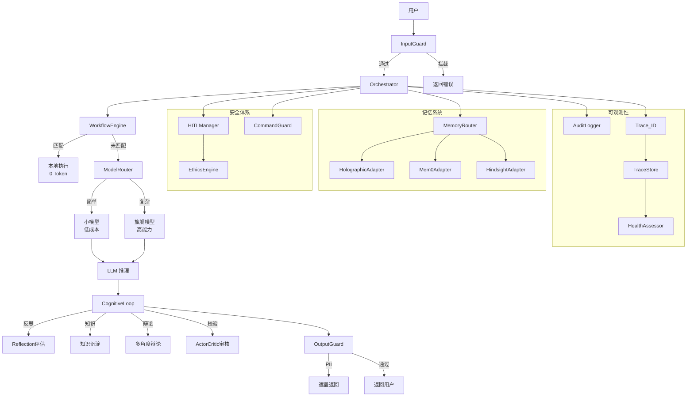
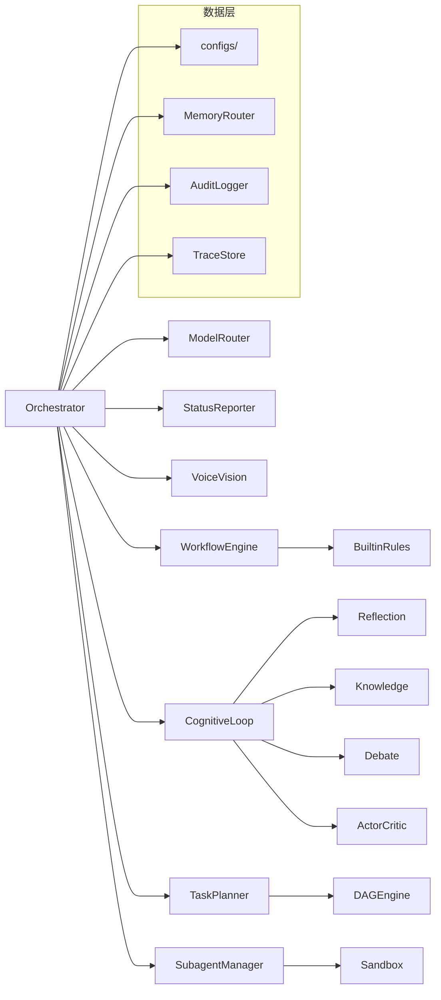
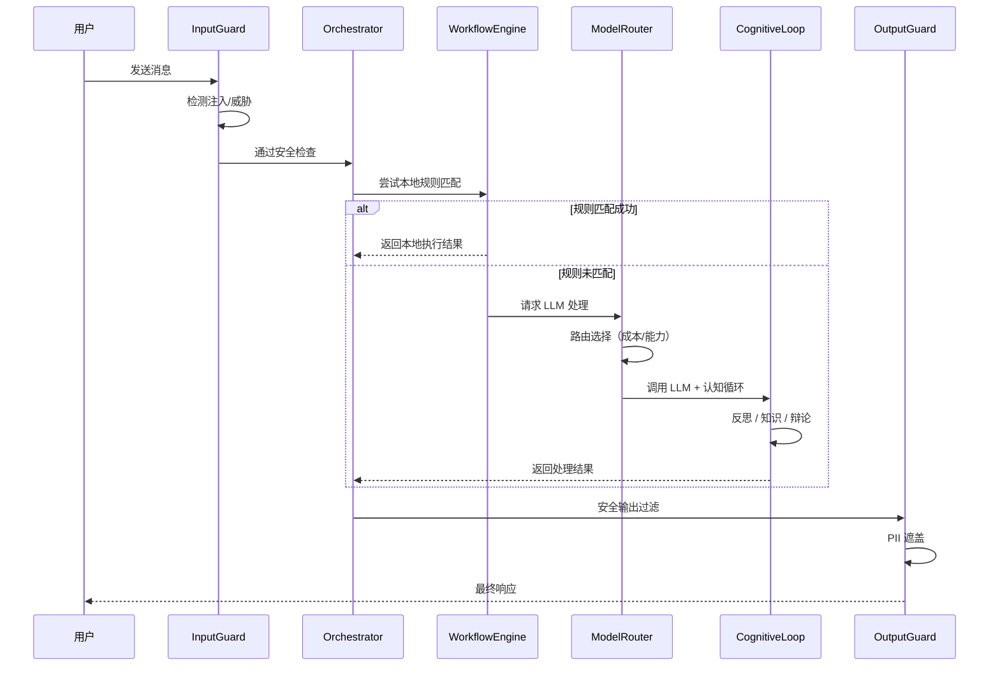

# 云枢系统架构图

## 完整数据流



## 模块依赖图



## 部署架构

```mermaid
graph TB
    Client[客户端] -->|HTTP/WS| API[API Server<br/>8123]
    API --> App[app_server.py]
    App --> Orch[Orchestrator]

    subgraph 本地
        Orch --> LLM_Local[LocalLLM<br/>Ollama/vLLM]
        Orch --> SQLite[(SQLite<br/>记忆存储)]
        Orch --> Files[(文件系统<br/>workspace)]
    end

    subgraph 云端（可选）
        Orch --> LLM_Cloud[GPT-4 / Claude]
        Orch --> Mem0[Mem0 Cloud]
        Orch --> Hindsight[Hindsight API]
    end

    subgraph 监控
        Prom[Prometheus]
        Health[Health Dashboard]
    end

    API --> Prom
    API --> Health
```

## 用户请求处理时序



## 模块责任清单

| 模块 | 文件名 | 核心职责 |
|------|--------|----------|
| Orchestrator | `orchestrator/orchestrator.py` | 消息路由、流程编排、异常恢复 |
| WorkflowEngine | `workflow_engine/engine.py` | 本地规则匹配、0 Token 决策 |
| CognitiveLoop | `cognitive/` | 反思纠错、知识沉淀、辩论、审核 |
| MemoryRouter | `memory/router.py` | 统一记忆接口、7 提供商自适应路由 |
| SubagentManager | `subagent/manager.py` | 容器生命周期、全选配启动 |
| InputGuard | `guardrails/input_guard.py` | SQL 注入 / XSS / 路径遍历检测 |
| CommandGuard | `guardrails/command_guard.py` | Shell 命令白名单 + 黑名单 |
| OutputGuard | `guardrails/output_guard.py` | PII 遮盖、敏感信息过滤 |
| HITLManager | `human_in_the_loop/manager.py` | 风险分级、人工确认流程 |
| EthicsEngine | `human_in_the_loop/ethics.py` | 11 条伦理硬约束 |
| ModelRouter | `model_router/router.py` | 成本敏感模型路由、降级策略 |
| CostTracker | `model_router/cost_tracker.py` | Token 用量统计、成本追踪 |
| TaskPlanner | `task_planner/planner.py` | DAG 目标分解、任务编排 |
| AuditLogger | `audit/logger.py` | 结构化 Append-only 审计日志 |
| TraceStore | `observability/trace_store.py` | 内存 Trace 存储、订阅通知 |
| HealthAssessor | `health/assessor.py` | 系统健康评分、模块状态检测 |
| ConfigLoader | `configs/loader.py` | YAML + 环境变量声明式配置 |
| ExtensionManager | `extensions/manager.py` | Skills / MCP / Plugins 安装管理 |

---

*本文档由 P23 自动生成，反映云枢系统 23 个 Phase 迭代后的最终架构。*
