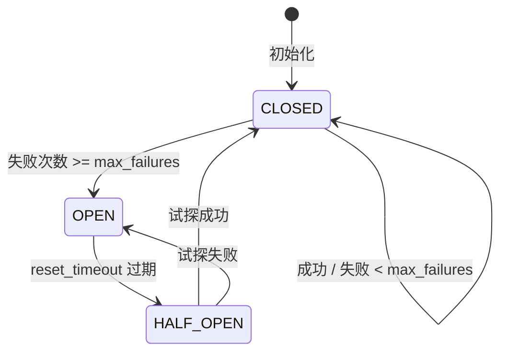

# CircuitBreaker 熔断器设计文档

本文档详细描述了 CircuitBreaker 熔断器的状态转换逻辑、时序图和实现细节。

## 目录

1. [概述](#1-概述)
2. [状态机设计](#2-状态机设计)
3. [状态转换时序图](#3-状态转换时序图)
4. [核心逻辑详解](#4-核心逻辑详解)
5. [实现代码分析](#5-实现代码分析)
6. [使用场景与示例](#6-使用场景与示例)
7. [配置参数说明](#7-配置参数说明)
8. [最佳实践](#8-最佳实践)
9. [故障排查指南](#9-故障排查指南)

---

## 1. 概述

### 1.1 什么是熔断器模式

熔断器模式（Circuit Breaker Pattern）是一种防止级联失败的弹性设计模式。它的核心思想类似于电路中的保险丝：当电流过大时，保险丝会熔断，切断电路，保护整个系统不受损坏。

在软件系统中，熔断器用于：
- **防止级联失败**：当某个服务持续失败时，快速失败而不是等待超时
- **保护系统稳定性**：避免无效请求堆积，保护下游服务
- **实现自我修复**：通过半开状态尝试恢复，自动感知服务健康状态

### 1.2 我们的熔断器特性

我们的 CircuitBreaker 实现具有以下特性：

| 特性 | 说明 |
|------|------|
| 三状态设计 | CLOSED（闭合）、OPEN（打开）、HALF_OPEN（半开） |
| 线程安全 | 使用 threading.Lock 保证并发安全 |
| 可配置参数 | 失败阈值、重置超时、半开超时均可配置 |
| 状态持久化 | 记录成功/失败次数和时间戳 |
| 监控友好 | 提供完整的状态查询接口 |

---

## 2. 状态机设计

### 2.1 三状态定义



### 2.2 状态详细说明

#### 2.2.1 CLOSED（闭合状态）- 正常状态

**定义**：熔断器处于闭合状态，允许所有请求通过。

**行为**：
- 正常执行业务逻辑
- 记录每次成功和失败
- 失败计数达到阈值时，切换到 OPEN 状态

**转换条件**：
- 进入：`__init__()` 初始化时
- 进入：`HALF_OPEN` 状态下试探成功
- 保持在：`CLOSED` 状态下失败次数 < max_failures

#### 2.2.2 OPEN（打开状态）- 熔断状态

**定义**：熔断器处于打开状态，拒绝所有请求，快速失败。

**行为**：
- 立即抛出 CriticalError 异常
- 不执行任何实际业务逻辑
- 等待 reset_timeout 后进入 HALF_OPEN 状态

**转换条件**：
- 进入：`CLOSED` 状态下连续失败次数 >= max_failures
- 进入：`HALF_OPEN` 状态下试探失败

#### 2.2.3 HALF_OPEN（半开状态）- 试探恢复状态

**定义**：熔断器处于半开状态，允许有限请求通过试探。

**行为**：
- 允许一个或少量请求通过
- 如果成功：恢复到 CLOSED 状态
- 如果失败：重新进入 OPEN 状态

**转换条件**：
- 进入：`OPEN` 状态下等待 reset_timeout 过期
- 保持：试探请求失败
- 退出：试探请求成功

---

## 3. 状态转换时序图

### 3.1 正常场景：成功调用

```
┌────────┐     ┌─────────────┐     ┌─────────────────┐     ┌───────────┐
│ Client │     │ CircuitBreaker│     │   Business Logic │     │ External  │
└──┬─────┘     └──────┬──────┘     └────────┬────────┘     └─────┬─────┘
   │                  │                      │                     │
   │  execute()       │                      │                     │
   │─────────────────>│                      │                     │
   │                  │                      │                     │
   │                  │   check state        │                     │
   │                  │─────────────────────>                     │
   │                  │                      │                     │
   │                  │                      │   call()            │
   │                  │                      │─────────────────────>│
   │                  │                      │                     │
   │                  │                      │   < 100ms           │
   │                  │                      │<─────────────────────│
   │                  │                      │                     │
   │                  │   record_success()   │                     │
   │                  │<─────────────────────│                     │
   │                  │                      │                     │
   │                  │   CLOSED (unchanged)  │                     │
   │                  │   success_count += 1 │                     │
   │                  │   failure_count = 0  │                     │
   │                  │                      │                     │
   │   success        │                      │                     │
   │<─────────────────│                      │                     │
   │                  │                      │                     │
```

**说明**：
1. 客户端调用 `execute()` 方法
2. 熔断器检查状态（当前为 CLOSED）
3. 执行业务逻辑，调用外部服务
4. 业务逻辑成功返回
5. 熔断器记录成功：`success_count += 1`，`failure_count = 0`
6. 返回结果给客户端

### 3.2 故障场景：连续失败导致熔断

```
┌────────┐     ┌─────────────┐     ┌─────────────────┐     ┌───────────┐
│ Client │     │ CircuitBreaker│     │   Business Logic │     │ External  │
└──┬─────┘     └──────┬──────┘     └────────┬────────┘     └─────┬─────┘
   │                  │                      │                     │
   │─ ─ ─ ─ ─ ─ ─ ─ ─│─ ─ ─ ─ ─ ─ ─ ─ ─ ─ ─│─ ─ ─ ─ ─ ─ ─ ─ ─ ─ ─│
   │  Request #1      │                      │                     │
   │                  │                      │                     │
   │                  │   call()             │                     │
   │                  │─────────────────────>│                     │
   │                  │                      │   ERROR!            │
   │                  │                      │<─────────────────────│
   │                  │                      │                     │
   │                  │   record_failure()   │                     │
   │                  │   failure_count = 1 │                     │
   │                  │                      │                     │
   │   exception      │                      │                     │
   │<─────────────────│                      │                     │
   │                  │                      │                     │
   │─ ─ ─ ─ ─ ─ ─ ─ ─│─ ─ ─ ─ ─ ─ ─ ─ ─ ─ ─│─ ─ ─ ─ ─ ─ ─ ─ ─ ─ ─│
   │  Request #2      │                      │                     │
   │                  │                      │                     │
   │                  │   call()             │                     │
   │                  │─────────────────────>│                     │
   │                  │                      │   ERROR!            │
   │                  │                      │<─────────────────────│
   │                  │                      │                     │
   │                  │   record_failure()   │                     │
   │                  │   failure_count = 2 │                     │
   │                  │                      │                     │
   │   exception      │                      │                     │
   │<─────────────────│                      │                     │
   │                  │                      │                     │
   │─ ─ ─ ─ ─ ─ ─ ─ ─│─ ─ ─ ─ ─ ─ ─ ─ ─ ─ ─│─ ─ ─ ─ ─ ─ ─ ─ ─ ─ ─│
   │  Request #3      │                      │                     │
   │                  │                      │                     │
   │                  │   call()             │                     │
   │                  │─────────────────────>│                     │
   │                  │                      │   ERROR!            │
   │                  │                      │<─────────────────────│
   │                  │                      │                     │
   │                  │   record_failure()   │                     │
   │                  │   failure_count = 3  │                     │
   │                  │                      │                     │
   │                  │   ⚡ STATE CHANGE    │                     │
   │                  │   CLOSED -> OPEN     │                     │
   │                  │                      │                     │
   │   CriticalError  │                      │                     │
   │<─────────────────│                      │                     │
   │                  │                      │                     │
   │─ ─ ─ ─ ─ ─ ─ ─ ─│─ ─ ─ ─ ─ ─ ─ ─ ─ ─ ─│─ ─ ─ ─ ─ ─ ─ ─ ─ ─ ─│
   │  Request #4      │                      │                     │
   │                  │                      │                     │
   │                  │   ⚡ OPEN state      │                     │
   │                  │   Immediately reject│                     │
   │                  │                      │                     │
   │   CriticalError  │                      │                     │
   │   (fast fail)    │                      │                     │
   │<─────────────────│                      │                     │
   │                  │                      │                     │
```

**说明**：
1. 第一次请求失败：`failure_count = 1`，状态保持 CLOSED
2. 第二次请求失败：`failure_count = 2`，状态保持 CLOSED
3. 第三次请求失败：`failure_count = 3`（达到阈值），状态变为 OPEN
4. 第四次及后续请求：立即抛出 CriticalError，不执行实际调用

### 3.3 恢复场景：OPEN -> HALF_OPEN -> CLOSED

```
时间轴
│──────────────────────────────────────────────────────────────────────────────│
│                                                                              │
│  ┌─────────┐      ┌─────────┐      ┌─────────┐      ┌─────────┐             │
│  │ Request │      │ Request │      │ Request │      │ reset   │             │
│  │   #1    │      │   #2    │      │   #3    │      │ timeout │             │
│  └────┬────┘      └────┬────┘      └────┬────┘      └────┬────┘             │
│       │                │                │                │                   │
│       ▼                ▼                ▼                ▼                   │
│   ┌───────┐        ┌───────┐        ┌───────┐        ┌───────┐                │
│   │ FAIL  │        │ FAIL  │        │ FAIL  │        │ FAIL  │                │
│   │ count │        │ count │        │ count │        │ count │                │
│   │  =1   │        │  =2   │        │  =3   │        │  =3   │                │
│   └───┬───┘        └───┬───┘        └───┬───┘        └───┬───┘                │
│       │                │                │                │                   │
│       │                │                │                │                   │
│       │                │                │                │                   │
│       │                │                │                │                   │
│       │                │                │                ▼                   │
│       │                │                │         ┌───────────┐              │
│       │                │                │         │   OPEN    │              │
│       │                │                │         │  STATE    │              │
│       │                │                │         └─────┬─────┘              │
│       │                │                │               │                    │
│       │                │                │               │ reset_timeout      │
│       │                │                │               │ elapsed            │
│       │                │                │               ▼                    │
│       │                │                │         ┌────────────┐             │
│       │                │                │         │  HALF_OPEN │             │
│       │                │                │         │   STATE    │             │
│       │                │                │         └─────┬──────┘             │
│       │                │                │               │                    │
│       │                │                │               │                    │
│       │                │                │               │ test request      │
│       │                │                │               ▼                    │
│       │                │                │         ┌───────────┐              │
│       │                │                │         │   CALL    │              │
│       │                │                │         └─────┬─────┘              │
│       │                │                │               │                    │
│       │                │                │               │ SUCCESS!           │
│       │                │                │               ▼                    │
│       │                │                │         ┌───────────┐              │
│       │                │                │         │   CLOSED  │              │
│       │                │                │         │  RECOVER  │              │
│       │                │                │         └───────────┘              │
│       │                │                │                                    │
│                                                                              │
└──────────────────────────────────────────────────────────────────────────────┘
```

**详细说明**：

1. **阶段 1：正常失败（第 0-3 次请求）**
   - 请求 #1, #2, #3 连续失败
   - 每次失败调用 `record_failure()`
   - `failure_count` 从 1 增加到 3
   - 达到阈值 `max_failures = 3`
   - 状态变为 OPEN

2. **阶段 2：熔断打开（第 3-63 秒）**
   - 所有请求立即失败
   - 不执行实际业务逻辑
   - `last_failure_time` 记录最后一次失败时间
   - 等待 `reset_timeout`（60 秒）

3. **阶段 3：半开试探（第 63 秒）**
   - `_can_reset()` 返回 True
   - 状态变为 HALF_OPEN
   - 记录 `half_open_start` 时间戳
   - 允许一个试探请求通过

4. **阶段 4：恢复成功（第 63+ 秒）**
   - 试探请求成功
   - 调用 `record_success()`
   - 状态恢复为 CLOSED
   - `failure_count` 重置为 0

### 3.4 半开失败场景：HALF_OPEN -> OPEN

```
┌─────────────┐
│   OPEN      │
│   STATE     │
└──────┬──────┘
       │
       │ reset_timeout
       │ elapsed
       ▼
┌────────────┐
│  HALF_OPEN │◄──────────────────────────────────────┐
│  STATE     │                                       │
└──────┬─────┘                                       │
       │                                             │
       │ test request                                │
       ▼                                             │
┌───────────────┐                                     │
│     CALL     │                                     │
└──────┬────────┘                                     │
       │                                             │
       │ FAILURE!                                    │
       ▼                                             │
┌───────────────┐                                     │
│record_failure │                                     │
└──────┬────────┘                                     │
       │                                             │
       │ ⚡ STATE CHANGE                             │
       │ HALF_OPEN -> OPEN                           │
       │ ⚡ last_failure_time = NOW()               │
       ▼                                             │
      END ───────────────────────────────────────────┘
```

**说明**：
1. OPEN 状态等待 reset_timeout 后进入 HALF_OPEN
2. 试探请求失败
3. 立即记录失败
4. 状态重新变为 OPEN
5. 重新等待 reset_timeout

---

## 4. 核心逻辑详解

### 4.1 record_failure() 核心逻辑

```python
def record_failure(self) -> None:
    """记录失败"""
    with self._lock:  # 线程安全保护
        self.failure_count += 1
        self.last_failure_time = datetime.now()
        
        if self.state == CircuitState.CLOSED:
            # 闭合状态下：检查是否达到阈值
            if self.failure_count >= self.max_failures:
                self.state = CircuitState.OPEN
                logger.warning(
                    f"Circuit breaker '{self.name}': OPENED "
                    f"after {self.failure_count} failures"
                )
        elif self.state == CircuitState.HALF_OPEN:
            # 半开状态下：任何失败都重新打开
            self.state = CircuitState.OPEN
            logger.warning(
                f"Circuit breaker '{self.name}': reopened "
                f"after failure in half-open state"
            )
```

**关键点**：
1. **线程安全**：使用 `with self._lock` 保护临界区
2. **阈值判断**：只有 CLOSED 状态才检查阈值
3. **半开失败**：半开状态下任何失败都会重新打开
4. **时间戳更新**：记录最后一次失败时间

### 4.2 record_success() 核心逻辑

```python
def record_success(self) -> None:
    """记录成功"""
    with self._lock:
        self.success_count += 1
        self.last_success_time = datetime.now()
        
        if self.state == CircuitState.HALF_OPEN:
            # 半开状态下成功：恢复到闭合
            self.state = CircuitState.CLOSED
            self.failure_count = 0  # 重置失败计数
            logger.info(
                f"Circuit breaker '{self.name}': "
                f"recovered to CLOSED state"
            )
        elif self.state == CircuitState.CLOSED:
            # 闭合状态下成功：重置失败计数
            self.failure_count = 0
```

**关键点**：
1. **半开恢复**：半开状态下的成功会完全恢复
2. **计数重置**：成功时 `failure_count = 0`
3. **状态重置**：只有半开状态才改变状态

### 4.3 execute() 核心逻辑

```python
def execute(self, func: Callable[P, R], *args, **kwargs) -> R:
    """执行函数，受断路器保护"""
    with self._lock:
        # 1. 检查 OPEN 状态
        if self.state == CircuitState.OPEN:
            if self._can_half_open():
                # 可恢复：进入半开状态
                self.state = CircuitState.HALF_OPEN
                self.half_open_start = datetime.now()
                logger.info(
                    f"Circuit breaker '{self.name}': "
                    f"transitioning to HALF_OPEN"
                )
            else:
                # 不可恢复：立即拒绝
                raise CriticalError(
                    f"Circuit breaker '{self.name}' is OPEN",
                    category=ErrorCategory.EXTERNAL_SERVICE,
                )
    
    # 2. 执行实际逻辑
    try:
        result = func(*args, **kwargs)
        self.record_success()
        return result
    except Exception:
        self.record_failure()
        raise
```

**关键点**：
1. **状态检查在锁内**：确保状态判断的原子性
2. **延迟决策**：OPEN 时不一定立即拒绝，可能进入 HALF_OPEN
3. **成功/失败回调**：在锁外调用，记录结果
4. **异常穿透**：捕获异常后记录失败，再重新抛出

---

## 5. 实现代码分析

### 5.1 类结构

```python
class CircuitBreaker:
    """熔断器模式实现"""
    
    def __init__(
        self,
        max_failures: int = 5,        # 最大失败次数
        reset_timeout: float = 60.0,   # 重置超时（秒）
        half_open_timeout: float = 30.0,# 半开超时（秒）
        name: str = "default",          # 熔断器名称
    ):
        # 配置参数
        self.max_failures = max_failures
        self.reset_timeout = reset_timeout
        self.half_open_timeout = half_open_timeout
        self.name = name
        
        # 状态变量
        self.state = CircuitState.CLOSED
        self.failure_count = 0
        self.success_count = 0
        self.last_failure_time: Optional[datetime] = None
        self.last_success_time: Optional[datetime] = None
        self.half_open_start: Optional[datetime] = None
        
        # 线程锁
        self._lock = threading.Lock()
```

### 5.2 辅助方法

```python
def _can_reset(self) -> bool:
    """检查是否可以重置断路器"""
    if self.last_failure_time is None:
        return False
    elapsed = (datetime.now() - self.last_failure_time).total_seconds()
    return elapsed >= self.reset_timeout

def _can_half_open(self) -> bool:
    """检查是否可以进入半开状态"""
    return self.state == CircuitState.OPEN and self._can_reset()
```

---

## 6. 使用场景与示例

### 6.1 基本使用

```python
from agent.error_handler import CircuitBreaker, TemporaryNetworkError

# 创建熔断器
cb = CircuitBreaker(
    max_failures=5,        # 连续 5 次失败后熔断
    reset_timeout=60.0,     # 60 秒后尝试恢复
    half_open_timeout=30.0, # 半开状态持续 30 秒
    name="api-service"
)

# 使用熔断器保护调用
def call_external_api():
    # 实际 API 调用逻辑
    response = http.get("https://api.example.com/data")
    return response.json()

# 执行调用
try:
    result = cb.execute(call_external_api)
    print(f"Success: {result}")
except Exception as e:
    print(f"Failed: {e}")
```

### 6.2 装饰器使用

```python
from agent.error_handler import with_circuit_breaker, CircuitBreaker

# 创建熔断器
api_circuit_breaker = CircuitBreaker(max_failures=3, name="api-breaker")

# 使用装饰器
@with_circuit_breaker(api_circuit_breaker)
def fetch_user_data(user_id):
    return api.get(f"/users/{user_id}")

@with_circuit_breaker(api_circuit_breaker)
def fetch_user_orders(user_id):
    return api.get(f"/users/{user_id}/orders")
```

### 6.3 与重试策略结合

```python
from agent.error_handler import (
    CircuitBreaker,
    RetryPolicy,
    ErrorHandler,
    TemporaryNetworkError
)

# 创建处理器
handler = ErrorHandler()

# 创建熔断器
cb = CircuitBreaker(max_failures=5, name="protected-api")

# 创建重试策略
policy = RetryPolicy(
    max_retries=3,
    initial_delay=1.0,
    max_delay=30.0,
    backoff_factor=2.0
)

# 执行带保护和重试的调用
try:
    result = handler.execute_with_retry(
        call_external_api,
        retry_policy=policy,
        circuit_breaker=cb,
        retryable_exceptions=(TemporaryNetworkError,)
    )
except Exception as e:
    print(f"All attempts failed: {e}")
```

---

## 7. 配置参数说明

### 7.1 参数详解

| 参数 | 类型 | 默认值 | 说明 |
|------|------|--------|------|
| `max_failures` | int | 5 | CLOSED 状态下允许的最大连续失败次数 |
| `reset_timeout` | float | 60.0 | OPEN 状态持续时间（秒），超时后进入 HALF_OPEN |
| `half_open_timeout` | float | 30.0 | HALF_OPEN 状态持续时间（秒） |
| `name` | str | "default" | 熔断器名称，用于日志和监控 |

### 7.2 配置建议

#### 7.2.1 高可用服务（API网关）

```python
CircuitBreaker(
    max_failures=10,       # 容忍更多失败
    reset_timeout=30.0,    # 快速恢复
    half_open_timeout=15.0,
    name="api-gateway"
)
```

#### 7.2.2 关键业务服务

```python
CircuitBreaker(
    max_failures=3,        # 敏感检测
    reset_timeout=120.0,   # 较长冷却时间
    half_open_timeout=60.0,
    name="payment-service"
)
```

#### 7.2.3 测试环境

```python
CircuitBreaker(
    max_failures=2,        # 快速触发
    reset_timeout=5.0,     # 快速恢复
    half_open_timeout=2.0,
    name="test-breaker"
)
```

---

## 8. 最佳实践

### 8.1 熔断器命名

**推荐做法**：
```python
# ✅ 好：清晰的命名
cb_api = CircuitBreaker(name="payment-api")
cb_db = CircuitBreaker(name="database-connection")

# ❌ 差：模糊的命名
cb1 = CircuitBreaker(name="default")
cb2 = CircuitBreaker(name="breaker")
```

### 8.2 隔离原则

**推荐做法**：为不同的外部依赖创建独立的熔断器
```python
# 为每个外部服务创建独立的熔断器
payment_cb = CircuitBreaker(max_failures=3, name="payment")
sms_cb = CircuitBreaker(max_failures=5, name="sms")
email_cb = CircuitBreaker(max_failures=5, name="email")
```

### 8.3 监控告警

**推荐做法**：监控熔断器状态变化
```python
# 注册监控回调
def on_state_change(old_state, new_state):
    if new_state == CircuitState.OPEN:
        alert("Circuit breaker opened!", severity="critical")
    elif new_state == CircuitState.HALF_OPEN:
        alert("Circuit breaker attempting recovery", severity="warning")
```

### 8.4 优雅降级

**推荐做法**：在熔断器打开时提供备用方案
```python
def get_product_info(product_id):
    try:
        return api_circuit_breaker.execute(fetch_from_api, product_id)
    except CriticalError:
        # 熔断器打开时，返回缓存数据或默认值
        return cache.get(product_id) or DEFAULT_PRODUCT
```

---

## 9. 故障排查指南

### 9.1 常见问题

#### 问题 1：熔断器频繁打开

**症状**：`failure_count` 迅速达到 `max_failures`

**可能原因**：
- 下游服务真的不可用
- `max_failures` 设置过低
- 失败的请求没有正确处理

**解决方案**：
```python
# 1. 检查下游服务健康状态
# 2. 适当提高 max_failures
cb = CircuitBreaker(max_failures=10)  # 从 5 提高到 10

# 3. 确保异常正确传播
def failing_func():
    try:
        risky_operation()
    except SomeError:
        raise  # 确保异常被抛出
```

#### 问题 2：熔断器无法恢复

**症状**：长时间处于 OPEN 状态

**可能原因**：
- `reset_timeout` 设置过长
- 下游服务持续不可用
- `half_open_timeout` 设置过短

**解决方案**：
```python
# 1. 检查服务日志，确认下游服务状态
# 2. 缩短 reset_timeout 用于测试
cb = CircuitBreaker(reset_timeout=10.0)  # 从 60 秒改为 10 秒

# 3. 手动触发恢复测试
cb.state = CircuitState.HALF_OPEN  # 仅用于测试！
```

#### 问题 3：半开状态反复切换

**症状**：HALF_OPEN -> OPEN 循环

**可能原因**：
- 下游服务不稳定
- 试探请求失败率太高

**解决方案**：
```python
# 1. 检查服务稳定性
# 2. 增加半开超时时间
cb = CircuitBreaker(
    half_open_timeout=60.0,  # 给予更多恢复时间
    max_failures=2           # 更敏感的检测
)
```

### 9.2 调试技巧

#### 9.2.1 查看熔断器状态

```python
# 获取完整状态
status = circuit_breaker.get_status()
print(f"State: {status['state']}")
print(f"Failure count: {status['failure_count']}")
print(f"Last failure: {status['last_failure_time']}")
```

#### 9.2.2 启用详细日志

```python
import logging

# 设置熔断器日志级别
logging.getLogger("agent.error_handler").setLevel(logging.DEBUG)

# 查看状态转换日志
# [INFO] Circuit breaker 'api-service': OPENED after 5 failures
# [INFO] Circuit breaker 'api-service': transitioning to HALF_OPEN
# [INFO] Circuit breaker 'api-service': recovered to CLOSED state
```

---

## 附录 A：状态转换表

| 当前状态 | 事件 | 条件 | 下一状态 | 动作 |
|---------|------|------|---------|------|
| CLOSED | record_failure() | failure_count >= max | OPEN | 重置失败计数 |
| CLOSED | record_failure() | failure_count < max | CLOSED | - |
| CLOSED | record_success() | - | CLOSED | 重置失败计数 |
| OPEN | execute() | can_reset()=True | HALF_OPEN | 记录开始时间 |
| OPEN | execute() | can_reset()=False | OPEN | 抛出 CriticalError |
| OPEN | record_failure() | - | OPEN | - |
| HALF_OPEN | execute() | - | CLOSED | 重置计数 |
| HALF_OPEN | record_failure() | - | OPEN | 记录失败时间 |
| HALF_OPEN | record_success() | - | CLOSED | 重置计数 |

---

## 附录 B：时序图 Mermaid 源码

### B.1 完整流程图

```mermaid
sequenceDiagram
    participant Client
    participant CB as CircuitBreaker
    participant Service as External Service
    participant Logger

    Note over CB: CLOSED State
    
    Client->>+CB: execute(func)
    CB->>CB: check state (CLOSED)
    CB->>+Service: call()
    Service-->>-CB: success/failure
    
    alt success
        CB->>CB: record_success()
        CB->>CB: failure_count = 0
        CB->>Logger: INFO: Success recorded
        CB-->>-Client: result
    else failure
        CB->>CB: record_failure()
        CB->>CB: failure_count += 1
        CB->>Logger: WARNING: Failure recorded
        
        alt failure_count >= max_failures
            CB->>CB: ⚡ STATE CHANGE
            CB->>Logger: WARNING: Circuit breaker OPENED
            Note over CB: OPEN State
        end
        
        CB-->>-Client: exception
    end

    rect rgb(255, 230, 230)
        Note over CB: OPEN State (After max_failures)
        
        Client->>+CB: execute(func)
        CB->>CB: check state (OPEN)
        
        alt can_reset() = True
            CB->>CB: state = HALF_OPEN
            CB->>Logger: INFO: Transitioning to HALF_OPEN
        else can_reset() = False
            CB-->>-Client: CriticalError (fast fail)
        end
    end

    rect rgb(255, 255, 230)
        Note over CB: HALF_OPEN State
        
        Client->>+CB: execute(func)
        CB->>+Service: test call()
        Service-->>-CB: success/failure
        
        alt success
            CB->>CB: state = CLOSED
            CB->>CB: failure_count = 0
            CB->>Logger: INFO: Recovered to CLOSED
            CB-->>-Client: result
        else failure
            CB->>CB: state = OPEN
            CB->>Logger: WARNING: Reopened after failure
            CB-->>-Client: exception
        end
    end
```

---

## 附录 C：相关文档

- [error_handler.py 实现代码](file:///c:/Users/Administrator/agent/agent/error_handler.py)
- [ADR-003 错误处理决策记录](file:///c:/Users/Administrator/agent/docs/adr/003-error-handling-retry.md)
- [错误处理使用示例](file:///c:/Users/Administrator/agent/docs/error-handler-examples.md)

---

**文档版本**：v1.0  
**最后更新**：2026-05-31  
**维护者**：云枢架构委员会
