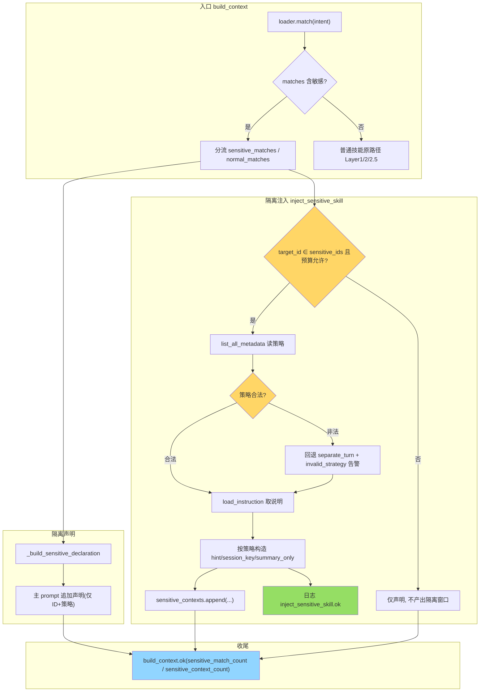

# 敏感技能独立上下文窗口隔离 — 执行路径分析

> 日期: 2026-08-05 ｜ 提交: `88835e36`（分支 `fix/ci-observability-flaky`）
> 模块: `agent/skills_mgmt/context_injector.py` / `loader.py` / `file_store.py` / `models.py`
> 本文档基于真实运行日志（`pytest tests/unit/test_skills_mgmt.py::TestSensitiveSkillIsolation -s --log-cli-level=INFO`）撰写。

## 1. 背景与设计目标

架构要求"敏感技能需独立上下文窗口"。涉及安全审核（safety_guard）、密钥操作（secret-ops）等敏感技能，
若其使用说明与普通技能一并注入主 System Prompt，将产生认知污染：
主 Agent 的推理上下文会同时承载敏感内容与业务内容，敏感边界被模糊。

隔离设计三原则（守【不易】）：

1. **主上下文仅声明存在**：`_build_sensitive_declaration` 产出声明文本（只含技能 ID 与隔离策略），
   不暴露 description / instruction。
2. **隔离内容独立预算**：敏感技能 instruction 进入 `sensitive_contexts`，token 不计入主上下文 `total_tokens`。
3. **普通技能走原流程**：`normal_matches` 继续走 Layer 1 元数据 → Layer 2 instruction → Layer 2.5 few-shot，路径零改动。

## 2. 整体分层结构

```
build_context(intent)
  │
  ├─ loader.match(intent)  → MatchResult.matches
  │
  ├─ 分流（新增，敏感识别点）
  │    ├─ sensitive_matches = [m for m in matches if m.is_sensitive]
  │    └─ normal_matches    = [m for m in matches if not m.is_sensitive]
  │
  ├─ _build_sensitive_declaration(sensitive_matches)   → 主上下文声明（仅 ID + 策略）
  │
  ├─ [normal_matches 非空]  ← 普通技能原路径
  │    ├─ inject_metadata(normal_matches)   # Layer 1（原样）
  │    ├─ inject_instruction(target_id)     # Layer 2（原样）
  │    └─ FewShotInjector.inject(...)       # Layer 2.5（原样，敏感跳过）
  │
  ├─ [target_id ∈ sensitive_ids]  ← 敏感技能隔离路径（新增，与 normal_matches 解耦）
  │    └─ inject_sensitive_skill(target_id) → sensitive_contexts
  │
  └─ return { ..., sensitive_declaration, sensitive_contexts,
              layers.layer4_sensitive_isolation }
```

## 3. 隔离策略三态

| 策略 | 语义 | 关键标记 |
|---|---|---|
| `separate_turn` | 当前轮次独立注入，下一轮次清除 | `clear_after_turn=True`、`summary_only=False`、`session_key=None` |
| `separate_session` | 独立会话，内容不进主会话历史 | `clear_after_turn=False`、`summary_only=False`、`session_key="sens-{skill_id}-{uuid}"` |
| `separate_agent` | 独立 Agent 调用，结果以 JSON 摘要返回主 Agent | `clear_after_turn=False`、`summary_only=True`、`session_key="sens-{skill_id}-{uuid}"` |

非法值（front matter 中 `isolation_strategy` 不属于三态）→ 回退 `separate_turn` 并输出 `inject_sensitive_skill.invalid_strategy` warning。

## 4. 执行路径

### 4.1 路径总览



### 4.2 关键分支决策点

| 决策点 | 判定依据 | 分支 |
|---|---|---|
| 技能是否敏感 | `SkillMatch.is_sensitive`（loader 7 处构造点透传自 front matter） | 敏感→声明+隔离；普通→原路径 |
| 是否产出隔离窗口 | `skill_id ∈ sensitive_ids` 且 `total_tokens < max_tokens`（显式 `skill_id` 参数或首个匹配敏感） | 是→注入隔离；否→仅声明 |
| 隔离策略取值 | `inject_sensitive_skill` 内 `list_all_metadata` 读取，非法回退 `separate_turn` | 三态分发 |
| 纯敏感场景 | `normal_matches` 为空（`no_match` 分支）时隔离注入仍执行（与 normal_matches 解耦） | 隔离窗口照常产出 |

## 5. 关键日志字段说明（实测样例）

以下样例为真实运行输出（已脱敏时间戳），用于执行路径排查。

### 5.1 `sensitive_decl.built` — 声明已构建

```json
{"action": "sensitive_decl.built", "sensitive_count": 1, "estimated_tokens": 62}
```

- `sensitive_count`：进入声明的敏感技能数
- `estimated_tokens`：声明文本 token 估算（独立于主上下文预算之外追加）

### 5.2 `build_context.layer1_done` — Layer 1 完成（混合场景）

```json
{"action": "build_context.layer1_done", "match_count": 1, "sensitive_match_count": 1,
 "layer1_tokens": 143, "boundary_passthrough": {"text_len": 164, "tokens": 75,
 "loaded": ["pdf-helper"], "unloaded": ["safety-guard", "secret-ops"]}}
```

- `match_count`：实际注入元数据的普通技能数（已过滤敏感）
- `sensitive_match_count`：被过滤的敏感技能数（分流可见性）
- `boundary_passthrough.loaded / unloaded`：边界声明中已加载/未加载技能清单；
  敏感技能（safety-guard / secret-ops）出现在 `unloaded`，**验证敏感技能不进 Layer 1 元数据**

### 5.3 `build_context.sensitive_declared` — 声明追加进主上下文

```json
{"action": "build_context.sensitive_declared", "sensitive_count": 1,
 "declaration_tokens": 62,
 "strategy_map": [{"skill_id": "safety-guard", "isolation_strategy": "separate_session"}]}
```

- `strategy_map`：每个敏感技能声明的隔离策略（排查声明内容是否正确的直接证据）

### 5.4 `build_context.sensitive_isolated` — 隔离窗口已产出

```json
{"action": "build_context.sensitive_isolated", "skill_id": "safety-guard",
 "isolation_strategy": "separate_session", "isolated_tokens": 10,
 "session_key": "sens-safety-guard-1b9554b5"}
```

- `isolated_tokens`：隔离窗口 token（**不计入主上下文 total_tokens**，独立预算）
- `session_key`：隔离会话标识（`separate_turn` 为 null；其余策略每次调用新生成）

### 5.5 `inject_sensitive_skill.ok` — 隔离注入成功（三策略差异可见）

```json
{"action": "inject_sensitive_skill.ok", "layer": "sensitive", "skill_id": "safety-guard",
 "isolation_strategy": "separate_agent", "summary_only": true,
 "clear_after_turn": false, "session_key": "sens-safety-guard-e88aa945",
 "estimated_tokens": 10}
```

- `summary_only / clear_after_turn / session_key`：三策略判别字段，见 §3 对照表

### 5.6 `build_context.ok` — 总览汇总

```json
{"action": "build_context.ok", "duration_ms": 10.06, "intent": "审核 PDF 解析",
 "total_tokens": 205, "budget": 6000, "match_count": 2, "sensitive_match_count": 1,
 "sensitive_context_count": 0, "has_instruction": true,
 "boundary_tokens": 75, "loaded_count": 1, "unloaded_count": 2,
 "retrieved_chunks": [{"skill_id": "pdf-helper", "score": 0.6, "layer": 1, "tokens": 68},
                       {"skill_id": "safety-guard", "score": 0.4, "layer": 1, "tokens": 78}],
 "retrieved_chunks_count": 2, "retrieved_chunks_truncated": false}
```

- `sensitive_match_count`：本次识别的敏感技能数
- `sensitive_context_count`：本次产出的隔离窗口数（0 = 仅声明未请求；>0 = 已隔离注入）
- `retrieved_chunks`：可观测性透传（含敏感技能条目，供上游工具调用链审计）

### 5.7 `build_context.no_match` — 纯敏感场景（无普通技能匹配）

```json
{"action": "build_context.no_match", "intent": "安全审核", "top_k": 5,
 "sensitive_match_count": 1, "boundary_state": "empty_default",
 "reason": "no_match_skipped_inject_metadata"}
```

- 纯敏感场景仍会继续执行隔离注入（`sensitive_isolated` 日志随后出现），**与 normal_matches 解耦**的设计在此可见

### 5.8 异常分支

```json
{"action": "inject_sensitive_skill.invalid_strategy", "skill_id": "safety-guard",
 "raw_strategy": "unknown", "fallback": "separate_turn"}           # WARNING: 非法策略回退

{"action": "build_context.sensitive_skill_not_found", "skill_id": "xxx",
 "error": "..."}                                                    # WARNING: 技能不存在
```

## 6. 三策略日志特征对比

| 场景 | `layer1_done` | `sensitive_declared` | `sensitive_isolated` | `inject_sensitive_skill.ok` 关键字段 |
|---|---|---|---|---|
| 仅声明（未请求） | `sensitive_match_count>0` | 出现 | 不出现 | — |
| separate_turn | 同左 | 出现 | 出现 | `summary_only=false, clear_after_turn=true, session_key=null` |
| separate_session | 同左 | 出现 | 出现 | `summary_only=false, clear_after_turn=false, session_key=sens-*` |
| separate_agent | 同左 | 出现 | 出现 | `summary_only=true, clear_after_turn=false, session_key=sens-*` |
| 纯敏感 | `no_match(sensitive_match_count>0)` | 出现 | 出现 | 同上 |

## 7. 隔离效果排查清单

1. **敏感技能是否进主上下文**：`ctx["prompt"]` 不应包含敏感技能 body 内容；
   边界声明 `boundary_declaration.unloaded` 应包含敏感技能 ID。
2. **隔离是否生效**：`ctx["layers"]["layer4_sensitive_isolation"]` 为 true；
   `build_context.sensitive_isolated` 日志出现且 `sensitive_context_count>0`。
3. **策略是否生效**：`inject_sensitive_skill.ok` 中 `isolation_strategy` 与 skill.md front matter 一致；
   `summary_only / clear_after_turn / session_key` 按 §3 对照。
4. **独立预算**：隔离 tokens 不计入 `total_tokens`（`total_tokens < budget` 且不因隔离超预算）。
5. **透传链路**：`loader.match` 结果中 `SkillMatch.is_sensitive` 正确 →
   skill.md front matter `is_sensitive` 必须为 true 且经 file_store 白名单持久化。

## 8. 回归与验证

- 单测：`pytest tests/unit/test_skills_mgmt.py -k "SensitiveSkillIsolation" -q` → 12 passed
  （含混合场景 3 技能 Mock：safety-guard / secret-ops / pdf-helper）
- 全量：`pytest tests/unit/test_skills_mgmt.py -q` → 73 passed + 1 xfailed
- pre-commit hook：`verify_core_invariants` 12/12 通过
