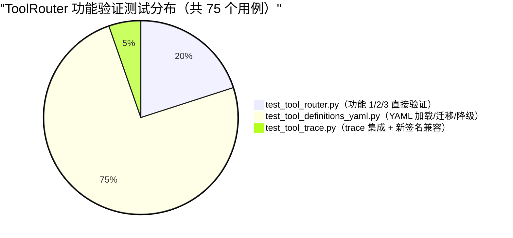
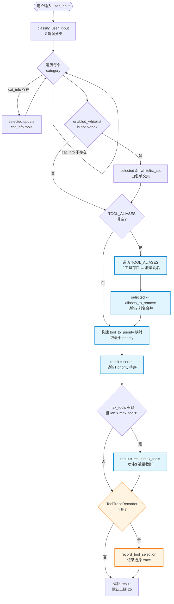
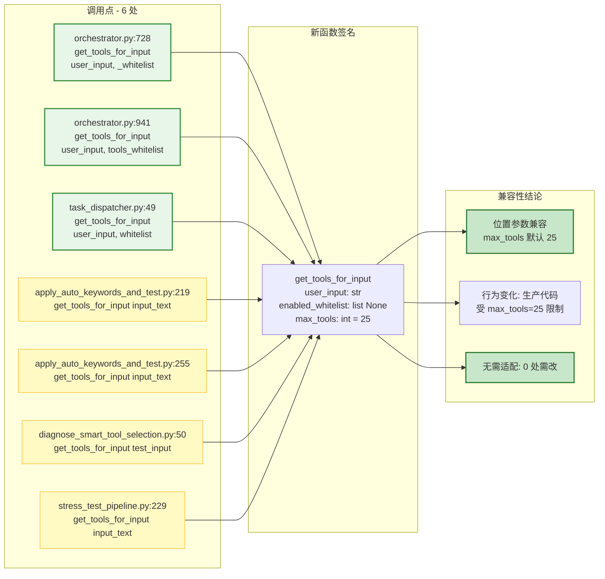
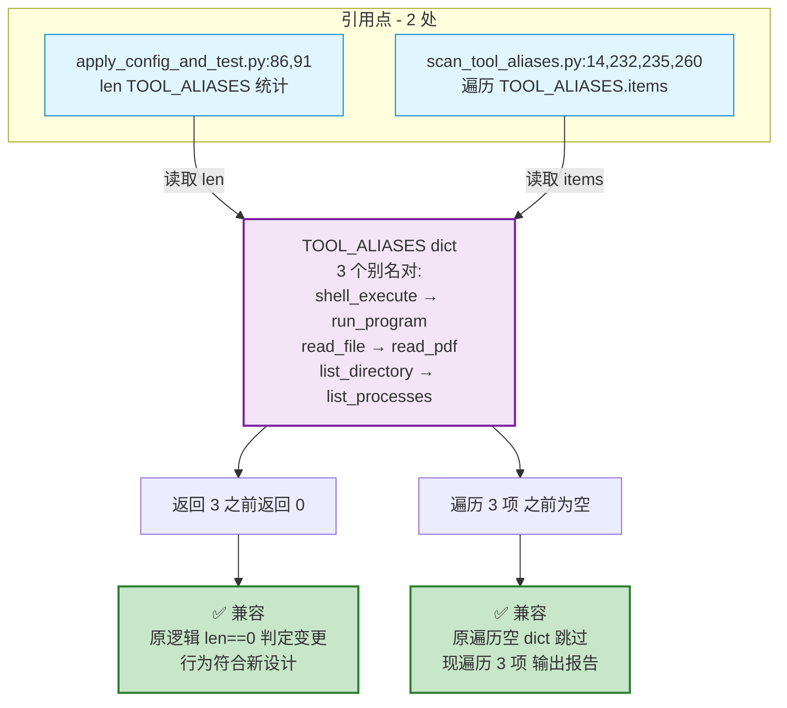
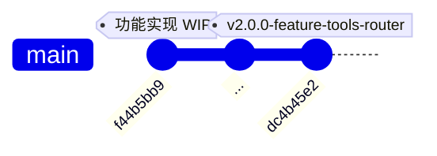

# ToolRouter 功能增强 Mermaid 图表

**生成日期**: 2026-07-19
**对应 tag**: `v2.0.0-feature-tools-router`
**对应 commit**: `dc4b45e2`
**数据来源**: [tool_router_features_changelog_20260719.md](./tool_router_features_changelog_20260719.md)

---

## 图表索引

| 编号 | 图表类型 | 主题 | 用途 |
|---|---|---|---|
| 1 | `pie` | 测试用例分布 | 展示 75 个测试用例在 3 个文件中的分布 |
| 2 | `flowchart` | `get_tools_for_input` 处理流程 | 展示功能 1/2/3 在函数内部的执行顺序 |
| 3 | `flowchart` | `get_tools_for_input` 调用点兼容性 | 6 处非测试调用点全部向后兼容 |
| 4 | `flowchart` | `TOOL_ALIASES` 引用点兼容性 | 2 处非测试引用点全部读取兼容 |
| 5 | `gitgraph` | 发布历史 | 展示 commit 链与 tag 关系 |

---

## 1. 测试用例分布（Pie Chart）

**总计**: 75 passed, 0 failed, 0 xfailed

### 测试结果对比表

| 测试文件 | 用例数 | 状态 | 关键验证点 |
|---|---|---|---|
| `agent/tests/test_tool_router.py` | 15 | ✅ passed | `test_priority_order`（priority 唯一性 + file=2 + 排序） `test_alias_merge`（3 个别名合并用例） `test_extreme_priority_conflict`（len ≤ 25） `test_performance_metrics`（len ≤ 25）|
| `tests/unit/test_tool_definitions_yaml.py` | 56 | ✅ passed | YAML 加载/字段完整性/索引同步/版本兼容/降级兜底 |
| `tests/unit/test_tool_trace.py` | 4 | ✅ passed | `test_tool_router_records_selection`（新签名兼容）|

---

## 2. `get_tools_for_input` 处理流程（Flowchart）

### 功能层注释

| 步骤 | 功能 | 不易约束 |
|---|---|---|
| 分类匹配 + 白名单交集 | 基础逻辑 | `classify_user_input` 未修改 |
| 别名合并（功能 2） | set 减法移除别名 | 主工具存在才移除，规则不变 |
| priority 排序（功能 1） | 升序排列 | 跨类别取最小 priority |
| 数量截断（功能 3） | 切片保留前 N | `max_tools=None/<=0` 不限制（向后兼容）|

---

## 3. `get_tools_for_input` 调用点兼容性（Flowchart）

6 处非测试代码调用，全部向后兼容（位置参数 + 新参数使用默认值）。

### 调用点明细对比表

| 文件 | 行号 | 调用方式 | 类型 | 兼容性 | 备注 |
|---|---|---|---|---|---|
| `agent/orchestrator/orchestrator.py` | 728 | `get_tools_for_input(user_input, _whitelist)` | 生产 | ✅ | 位置参数兼容，受 max_tools=25 默认限制 |
| `agent/orchestrator/orchestrator.py` | 941 | `get_tools_for_input(user_input, tools_whitelist)` | 生产 | ✅ | 同上 |
| `agent/orchestrator/task_dispatcher.py` | 49 | `get_tools_for_input(user_input, whitelist)` | 生产 | ✅ | TaskDispatcher 统一入口 |
| `scripts/apply_auto_keywords_and_test.py` | 219 | `get_tools_for_input(input_text)` | 脚本 | ✅ | 单参数兼容 |
| `scripts/apply_auto_keywords_and_test.py` | 255 | `get_tools_for_input(input_text)` | 脚本 | ✅ | 单参数兼容 |
| `scripts/diagnose_smart_tool_selection.py` | 50 | `get_tools_for_input(test_input)` | 脚本 | ✅ | 诊断脚本兼容 |
| `scripts/stress_test_pipeline.py` | 229 | `get_tools_for_input(input_text)` | 脚本 | ✅ | 压测脚本兼容 |

---

## 4. `TOOL_ALIASES` 引用点兼容性（Flowchart）

2 处非测试代码引用，全部为读取操作（统计/遍历），与填充后的 dict 完全兼容。

### 引用点行为变化对比

| 文件 | 行号 | 之前行为（TOOL_ALIASES={}）| 现在行为（3 个别名对）| 影响 |
|---|---|---|---|---|
| `apply_config_and_test.py` | 86, 91 | `len(TOOL_ALIASES) == 0` | `len(TOOL_ALIASES) == 3` | 报告中显示 3 个别名（符合新设计）|
| `scan_tool_aliases.py` | 14, 232, 235, 260 | 遍历空 dict，无输出 | 遍历 3 项，输出 3 个别名对 | 扫描报告含 3 条记录（符合新设计）|

---

## 5. 发布历史（GitGraph）

### Tag 信息

| 字段 | 值 |
|---|---|
| Tag 名称 | `v2.0.0-feature-tools-router` |
| Tag 类型 | 附注 tag（`git tag -a`）|
| 目标 commit | `dc4b45e2` |
| 创建日期 | 2026-07-19 |
| 包含内容 | 3 项功能增强 + 75 测试通过 + 8 处调用点兼容 |
| 关联 commit | `f44b5bb9`（代码实现）+ `dc4b45e2`（文档记录）|

---

## 三义自检

### 【不易】数据来源可靠
- 测试结果来自实际 pytest 执行输出（75 passed, 0 failed, 0 xfailed）
- 调用点来自全代码库 grep（6 处 get_tools_for_input + 2 处 TOOL_ALIASES）
- Tag 数据来自 `git show v2.0.0-feature-tools-router` 实际输出

### 【变易】图表可扩展
- 新增测试文件 → pie chart 添加新切片
- 新增调用点 → flowchart 添加新节点
- 后续 release → gitgraph 添加新 commit + tag

### 【简易】单一文档自包含
- 5 类图表集中在 1 个 Markdown 文件
- 每个图表配对比表，便于复制到 PR 描述或发布说明
- Mermaid 语法可在 GitHub / GitLab / VS Code 直接渲染
