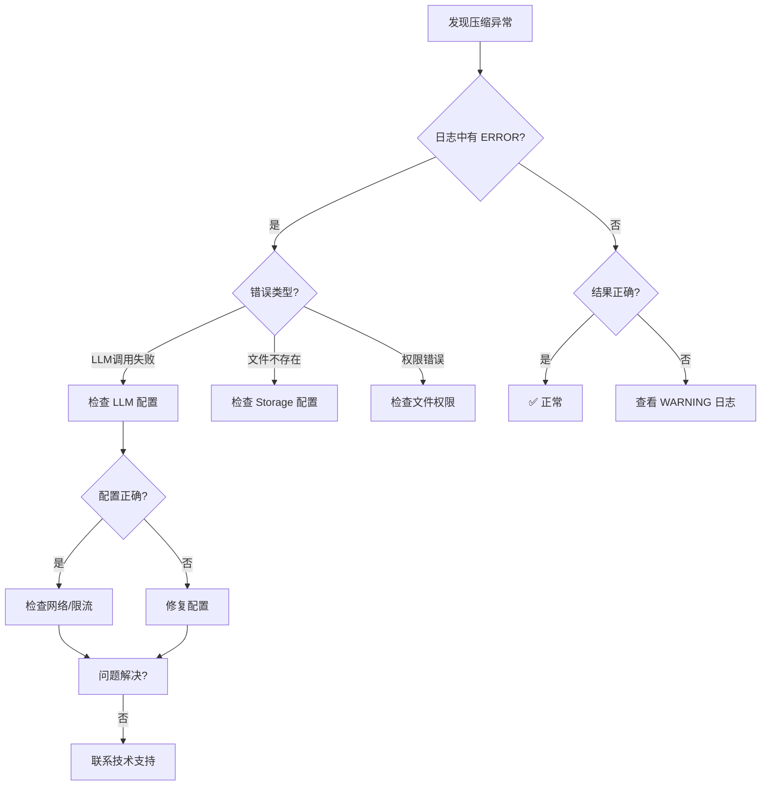

# 压缩逻辑错误排查指南

**适用版本**：MemoryManager v1.0  
**日志文件**：`logs/test_compression.log`  
**最后更新**：2026-05-31

---

## 🚨 错误类型速查表

| 错误关键词 | 可能原因 | 解决方案 | 优先级 |
|-----------|---------|---------|--------|
| `LLM调用失败` | API Key 配置错误、网络问题、API 限流 | 检查 LLM 配置和网络连接 | 🔴 高 |
| `无消息需要压缩` | 消息列表为空 | 正常情况，无需处理 | 🟢 信息 |
| `摘要或版本文件不存在` | 首次运行或文件被删除 | 正常情况，首次运行会出现 | 🟢 信息 |
| `文件不存在` | 数据目录被清理 | 检查 Storage 配置 | 🟡 中 |
| `压缩失败` | LLM 异常、存储异常 | 查看具体堆栈跟踪 | 🔴 高 |

---

## 🔍 常见错误详解

### 1. LLM 调用失败

**日志特征**：
```
ERROR    memory.memory_manager:memory_manager.py:181 [压缩流程] 压缩失败: LLM调用失败
Traceback (most recent call last):
  ...
  File "memory_manager.py", line 158, in _execute_compression
    summary = self._summarizer.compress(recent_messages)
  ...
Exception: LLM调用失败
```

**可能原因**：

| 原因 | 检查项 | 修复方法 |
|------|--------|---------|
| API Key 未配置 | `config["llm"]["api_key"]` | 添加有效的 API Key |
| API Key 无效 | 测试 API 连接 | 更换有效的 API Key |
| 网络连接问题 | 检查防火墙/代理 | 配置网络或使用代理 |
| API 限流 | 检查 API 提供商状态 | 降低调用频率或升级套餐 |
| 模型不可用 | 检查模型名称 | 使用支持的模型名称 |

**排查命令**：
```bash
# 检查 LLM 配置
grep -A 5 "llm" config.yaml

# 测试 API 连接
curl -X POST https://api.openai.com/v1/models
```

**修复建议**：
```python
config = {
    "llm": {
        "provider": "openai",
        "api_key": "sk-your-valid-key",  # 确保此处配置正确
        "model": "gpt-4",
        "timeout": 30
    }
}
manager = MemoryManager(config=config)
```

---

### 2. 摘要保存失败

**日志特征**：
```
WARNING  memory.storage:storage.py:85 [Storage.save_summary] 保存摘要失败
```

**可能原因**：

| 原因 | 检查项 | 修复方法 |
|------|--------|---------|
| 目录权限不足 | 检查 data_dir 权限 | 赋予读写权限 |
| 磁盘空间不足 | `df -h` 检查磁盘 | 清理磁盘空间 |
| 文件被锁定 | 检查其他进程 | 关闭其他进程 |

**排查命令**：
```bash
# 检查目录权限
ls -la memory_data/

# 检查磁盘空间
df -h

# 检查进程占用
lsof memory_data/summary.txt
```

---

### 3. 消息加载失败

**日志特征**：
```
WARNING  memory.storage:storage.py:68 [Storage.load_recent_messages] 文件不存在: ...
INFO     memory.memory_manager:memory_manager.py:151 [压缩流程] 加载到消息数: 0
WARNING  memory.memory_manager:memory_manager.py:154 [压缩流程] 无消息需要压缩，跳过
```

**可能原因**：

| 原因 | 检查项 | 修复方法 |
|------|--------|---------|
| 首次运行 | 检查 data_dir | 正常情况，首次运行会出现 |
| 数据被清空 | 检查 clear_memory 调用 | 检查业务逻辑 |
| 文件被误删 | 检查备份 | 从备份恢复 |

**排查命令**：
```bash
# 检查消息文件
ls -la memory_data/messages.jsonl

# 检查文件内容
head -5 memory_data/messages.jsonl
```

---

### 4. 后台压缩未执行

**日志特征**：
```
[同步压缩] 检测到压缩需求，后台线程状态: False
[同步压缩] 后台线程未运行，执行同步压缩
```

**诊断说明**：
- 如果 `后台线程状态: False` 持续出现，说明后台压缩线程未启动
- 同步压缩作为 fallback 机制正常工作

**排查命令**：
```bash
# 检查后台线程是否运行
ps aux | grep python

# 检查日志中是否有 "后台压缩线程已启动"
grep "后台压缩线程已启动" logs/app.log
```

**修复建议**：
```python
config = {
    "async_compress": {
        "enabled": True,           # 确保启用
        "interval_seconds": 60     # 检查间隔
    }
}
```

---

### 5. 压缩版本号异常

**日志特征**：
```
[压缩流程] 压缩完成！摘要版本: 0, 消息数: 5  # 版本为 0 异常
```

**可能原因**：
- 旧摘要加载失败
- 版本文件损坏

**排查命令**：
```bash
# 检查版本文件
cat memory_data/summary_version.txt

# 检查摘要文件
head -1 memory_data/summary.txt
```

**修复方法**：
```python
# 手动重置版本号
with open("memory_data/summary_version.txt", "w") as f:
    f.write("1")
```

---

## 📊 日志分析脚本

### 快速检查压缩健康状态

```bash
#!/bin/bash
# check_compression_health.sh

LOG_FILE="logs/test_compression.log"

echo "=== 压缩逻辑健康检查 ==="
echo ""

echo "1. 压缩成功次数:"
grep "压缩完成！" $LOG_FILE | wc -l

echo ""
echo "2. 压缩失败次数:"
grep "压缩失败" $LOG_FILE | wc -l

echo ""
echo "3. 最近 5 次压缩结果:"
grep "压缩完成！" $LOG_FILE | tail -5

echo ""
echo "4. 最近 5 次错误:"
grep "ERROR" $LOG_FILE | tail -5

echo ""
echo "5. 版本号分布:"
grep "压缩完成" $LOG_FILE | grep -oP "版本: \K[0-9]+" | sort | uniq -c
```

### 运行健康检查

```bash
chmod +x check_compression_health.sh
./check_compression_health.sh
```

---

## 🔧 调试模式

### 启用详细日志

在生产环境中，建议调整日志级别以获得更多信息：

```python
import logging

# 设置压缩模块日志为 DEBUG 级别
logging.getLogger('memory.memory_manager').setLevel(logging.DEBUG)

# 重新初始化 MemoryManager
manager = MemoryManager(config)
```

### 日志输出示例（DEBUG 模式）

```
DEBUG   [压缩流程] 入口参数: token_limit=4096
DEBUG   [压缩流程] 当前消息数: 50
DEBUG   [压缩流程] Token 统计: 3800/4096
DEBUG   [压缩流程] 是否触发压缩: True
INFO    [压缩流程] 步骤1: 加载旧摘要
...
```

---

## 📞 获取帮助

如果以上指南无法解决您的问题，请：

1. **收集日志**：导出相关时间段的完整日志
   ```bash
   grep "memory.memory_manager" logs/app.log > debug_logs.txt
   ```

2. **复现问题**：记录问题的复现步骤

3. **环境信息**：
   ```bash
   python --version
   pip list | grep -i memory
   ```

4. **提交 Issue**：包含以上所有信息

---

## ✅ 排查流程图



---

## 📝 错误日志模板

提交问题时，请使用以下模板：

```markdown
## 问题描述
[简洁描述遇到的问题]

## 环境信息
- Python 版本: 
- 代码版本: 
- 操作系统: 

## 日志片段
```
[粘贴相关日志，至少 20 行]
```

## 复现步骤
1. 
2. 
3. 

## 尝试的解决方案
- 
```
