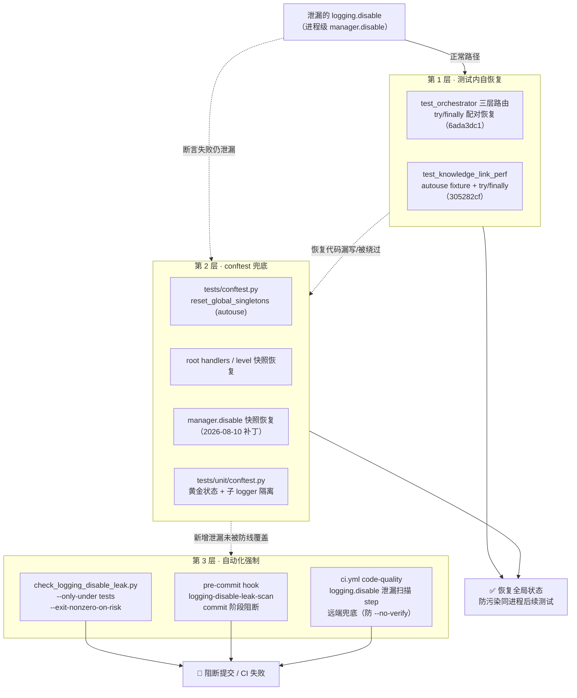
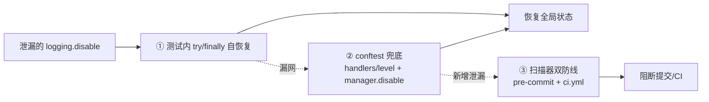

# logging 泄漏防线全景图（Mermaid）— Wiki 可插入

> 来源：logging_leak_scan_report_20260810.md §6 防线全景（2026-08-10）
> 用法：复制下方代码块至 GitHub Wiki / Confluence（Mermaid 支持）或任意 Mermaid 渲染器

```mermaid
flowchart TD
    subgraph L1["第 1 层 · 测试内自恢复"]
        A1["test_orchestrator 三层路由<br/>try/finally 配对恢复<br/>（6ada3dc1）"]
        A2["test_knowledge_link_perf<br/>autouse fixture + try/finally<br/>（305282cf）"]
    end

    subgraph L2["第 2 层 · conftest 兜底"]
        B1["tests/conftest.py<br/>reset_global_singletons (autouse)"]
        B2["root handlers / level 快照恢复"]
        B3["manager.disable 快照恢复<br/>（2026-08-10 补丁）"]
        B4["tests/unit/conftest.py<br/>黄金状态 + 子 logger 隔离"]
    end

    subgraph L3["第 3 层 · 自动化强制"]
        C1["pre-commit hook<br/>logging-disable-leak-scan<br/>commit 阶段阻断"]
        C2["ci.yml code-quality<br/>logging.disable 泄漏扫描 step<br/>远端兜底（防 --no-verify）"]
        C3["check_logging_disable_leak.py<br/>--only-under tests<br/>--exit-nonzero-on-risk"]
    end

    LEAK["泄漏的 logging.disable<br/>（进程级 manager.disable）"]
    R1["✅ 恢复全局状态<br/>防污染同进程后续测试"]
    R2["🚫 阻断提交 / CI 失败"]

    LEAK -->|正常路径| L1
    LEAK -.断言失败仍泄漏.-> L2
    L1 -.恢复代码漏写/被绕过.-> L2
    L2 -.新增泄漏未被防线覆盖.-> L3
    L1 --> R1
    L2 --> R1
    C3 --> R2
    C1 --> R2
    C2 --> R2
```

---

## 备选：纵向紧凑版（窄屏友好）

```mermaid
flowchart LR
    LEAK["泄漏的 logging.disable"]
    L1["① 测试内 try/finally 自恢复"]
    L2["② conftest 兜底<br/>handlers/level + manager.disable"]
    L3["③ 扫描器双防线<br/>pre-commit + ci.yml"]
    R1["恢复全局状态"]
    R2["阻断提交/CI"]
    LEAK --> L1 --> R1
    L1 -.漏网.-> L2 --> R1
    L2 -.新增泄漏.-> L3 --> R2
```
